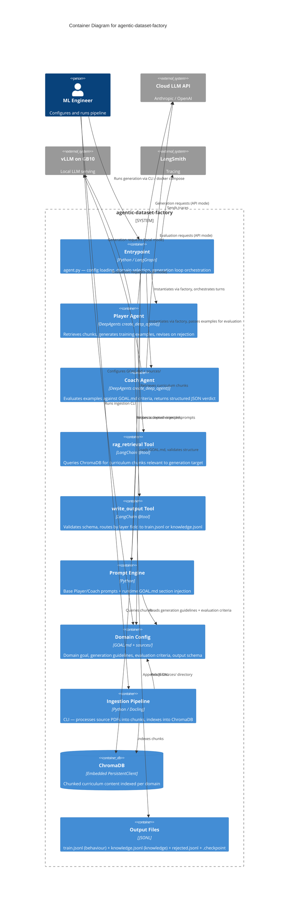

# Container Diagram — C4 Level 2

> Generated by `/system-arch` on 2026-03-16

## Container Diagram

## Containers

| Container | Technology | Responsibility |
|-----------|-----------|----------------|
| Entrypoint | Python / LangGraph | `agent.py` — config loading, domain selection, GOAL.md validation, generation loop orchestration |
| Player Agent | DeepAgents `create_deep_agent()` | Retrieves curriculum chunks via RAG, generates training examples, revises on Coach rejection |
| Coach Agent | DeepAgents `create_deep_agent()` | Evaluates examples against GOAL.md criteria, returns structured JSON verdict. No tools (D5). |
| rag_retrieval Tool | LangChain `@tool` | Queries ChromaDB for curriculum chunks relevant to current generation target |
| write_output Tool | LangChain `@tool` | Validates example against output schema, routes by `layer` field to correct output file |
| Prompt Engine | Python | Base Player/Coach prompt templates + runtime injection of GOAL.md sections |
| Domain Config | GOAL.md + sources/ | Domain goal definition, generation guidelines, evaluation criteria, output schema |
| Ingestion Pipeline | Python / Docling | CLI tool — processes source PDFs (standard + VLM modes) into chunks, indexes into ChromaDB |
| ChromaDB | Embedded PersistentClient | Chunked curriculum content, one collection per domain, persisted to disk |
| Output Files | JSONL | `train.jsonl` (behaviour), `knowledge.jsonl` (knowledge), `rejected.jsonl` (discards), `.checkpoint` (resume state — ADR-ARCH-010) |

## Key Design Decisions Visible in Diagram

- **Player has tools, Coach does not** (D5) — enforces role separation
- **Both agents connect to LLM providers** — configurable via `agent-config.yaml`
- **Ingestion is a separate CLI step** — runs before generation, populates ChromaDB
- **Domain Config is read by multiple components** — central abstraction
- **Output is file-based** — no runtime API, downstream projects consume JSONL files
- **Checkpoint file** (ADR-ARCH-010) — `output/.checkpoint` enables `--resume` after failure
