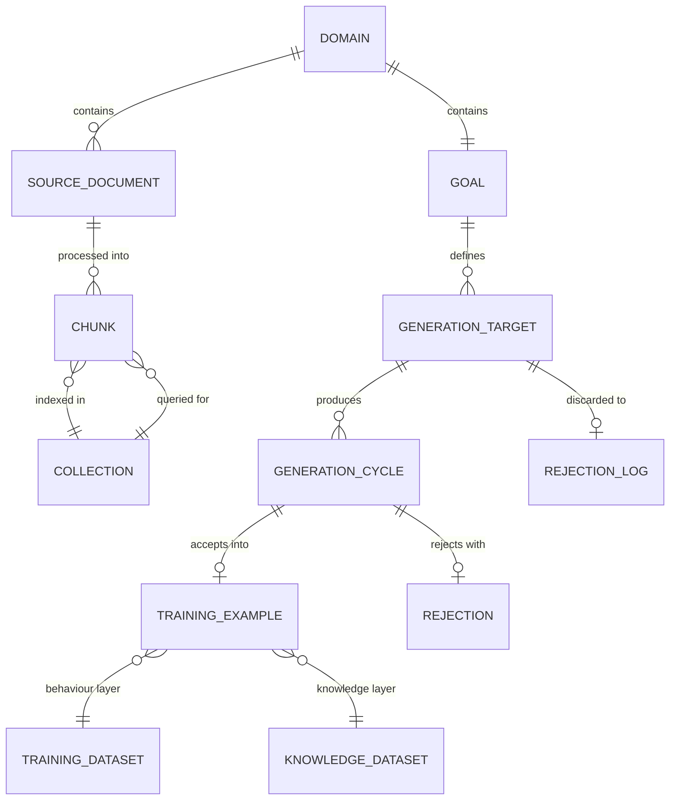

# Domain Model — agentic-dataset-factory

> Generated by `/system-arch` on 2026-03-16

## Core Domains

### 1. Domain Configuration

The central abstraction. Each use case is a directory containing a GOAL.md and source documents. No code changes required to add a new domain.

**Entities:**
- **Domain** — a named use case directory (`domains/{name}/`)
- **Goal** — the GOAL.md file defining dataset generation parameters
- **Source Document** — input PDF/text in `domains/{name}/sources/`

**Relationships:**
- A Domain contains exactly one Goal and zero or more Source Documents
- A Goal defines Generation Guidelines (consumed by Player) and Evaluation Criteria (consumed by Coach)
- A Goal defines an Output Schema that all generated examples must conform to

### 2. Ingestion

One-time pre-processing step per domain. Converts source documents into queryable chunks.

**Entities:**
- **Chunk** — a text segment extracted from a source document by Docling
- **Collection** — a ChromaDB collection containing all chunks for one domain

**Relationships:**
- Source Documents are processed by Docling into Chunks
- Chunks are indexed into a Collection (one per domain)
- The Collection is queried by the `rag_retrieval` tool during generation

### 3. Generation

The core pipeline — Player-Coach adversarial loop producing training examples.

**Entities:**
- **Generation Target** — a specific example to generate (topic, type, grade target, text)
- **Training Example** — a ShareGPT-format message sequence with metadata
- **Rejection** — a structured JSON evaluation from the Coach with score, issues, criteria assessment
- **Generation Cycle** — one Player attempt + Coach evaluation (a single turn in the loop)

**Relationships:**
- A Generation Target produces one or more Generation Cycles
- Each Generation Cycle results in either an acceptance (Training Example written) or a Rejection
- After max turns of Rejection, the Generation Target is discarded and logged
- Accepted Training Examples are routed by layer: behaviour → train.jsonl, knowledge → knowledge.jsonl

### 4. Output

The generated artefacts consumed by downstream projects.

**Entities:**
- **Training Dataset** — `output/train.jsonl` (behaviour layer, ShareGPT format)
- **Knowledge Dataset** — `output/rag_index/knowledge.jsonl` (knowledge layer)
- **Rejection Log** — `output/rejected.jsonl` (discarded examples with reasons)

**Relationships:**
- Training Dataset is consumed by Unsloth for fine-tuning (downstream)
- Knowledge Dataset is consumed by study-tutor-factory for ChromaDB seeding (downstream)
- Rejection Log is used by ML engineer for quality analysis and prompt improvement

## Domain Model Diagram



## Layer Routing

The `layer` field in each Training Example's metadata drives routing:

| Layer | Destination | Purpose |
|-------|-------------|---------|
| `behaviour` | `output/train.jsonl` | Teaches HOW the model responds (Socratic questioning, AO-aligned feedback, grade calibration) |
| `knowledge` | `output/rag_index/knowledge.jsonl` | Provides WHAT the model draws from (factual recall, quotes, themes, mark scheme criteria) |

**Architectural principle:** Fine-tuning teaches behaviour, not facts (Daniel Bourke, March 2026). The two layers are independently updatable.

## Training Example Structure

```json
{
  "messages": [
    {"role": "system", "content": "<system prompt>"},
    {"role": "user", "content": "<student question>"},
    {"role": "assistant", "content": "<think>...</think>\n\n<response>"}
  ],
  "metadata": {
    "layer": "behaviour | knowledge",
    "type": "reasoning | direct",
    "ao": ["AO1", "AO2"],
    "text": "macbeth | a_christmas_carol | ...",
    "topic": "character_analysis | essay_feedback | ...",
    "grade_target": 4-9 | null,
    "source": "synthetic",
    "turns": 1
  }
}
```

75% reasoning (with `<think>` blocks) / 25% direct — Nemotron MoE constraint (D13).
