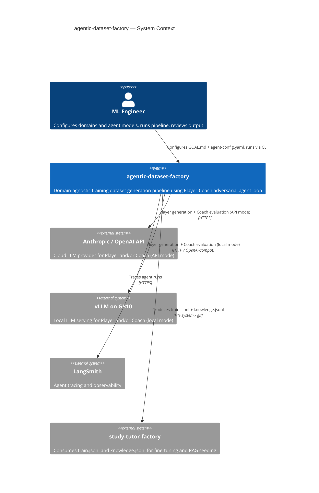

# System Context — C4 Level 1

> Generated by `/system-arch` on 2026-03-16

## System Context Diagram

## Actors

| Actor | Type | Interaction |
|-------|------|-------------|
| ML Engineer | Human | Configures GOAL.md, agent-config.yaml, runs ingestion + generation via CLI |

## External Systems

| System | Purpose | Protocol | Mode |
|--------|---------|----------|------|
| Anthropic / OpenAI API | Cloud LLM for Player and/or Coach | HTTPS / Messages API | Configured via agent-config.yaml |
| vLLM on GB10 | Local LLM for Player and/or Coach | HTTP / OpenAI-compat API | Configured via agent-config.yaml |
| LangSmith | Agent tracing and observability | HTTPS | Always on when `LANGSMITH_TRACING=true` |
| study-tutor-factory | Consumes generated datasets | File system / git | Downstream — reads output/ |

## Key Relationships

- Both Player and Coach agent models are configurable between cloud API and local vLLM via `agent-config.yaml`
- The system produces file-based output (JSONL) — no runtime API exposed
- LangSmith integration is passive (outbound traces only)
- The consuming project (`study-tutor-factory`) reads output files; there is no runtime coupling
