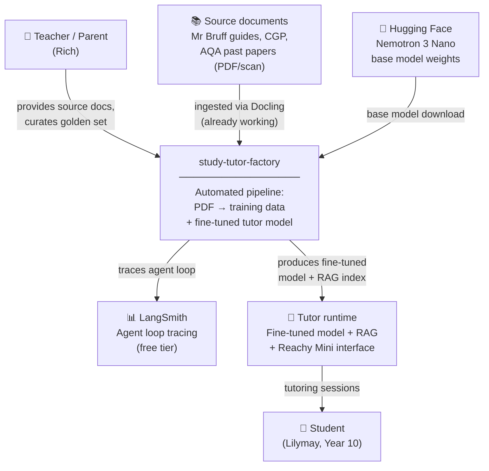
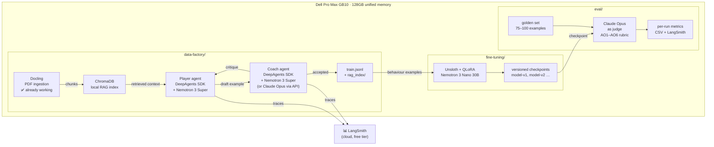
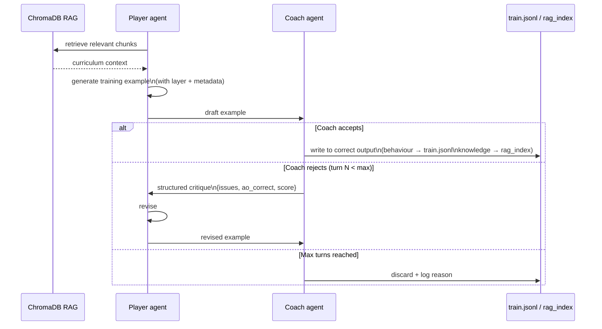

# study-tutor-factory — Conversation Starter
## For: /system-arch session · New repo · March 2026

---

## What this document is

This is the context brief for the `/system-arch` command session on the
`study-tutor-factory` repository. All decisions below are resolved. Do not
re-litigate them during `/system-arch` — they are the grounding context, not
open questions.

Paste this document at the start of the session, then run `/system-arch`.

---

## Project purpose (one sentence)

An automated, repeatable, open-source pipeline that ingests curriculum source
documents and produces fine-tuning training datasets for on-device AI tutors —
starting with GCSE English, designed to extend to any subject.

---

## The core insight driving the architecture

Daniel Bourke (Queensland AI Meetup, March 2026): fine-tuning teaches
**behaviour**, not facts. The model learns *how to respond* — structure, style,
tone, pedagogical approach. Facts come from RAG at inference time.

**For this project this means:**
- The fine-tuned model learns *how to tutor* — Socratic questioning, AO-aligned
  feedback, grade-appropriate explanations, guiding vs giving
- The RAG index holds *what to teach from* — quotes, themes, mark scheme
  criteria, character analysis
- These are two independently updateable layers; changing the curriculum does
  not require retraining the model

The Mr Bruff guides and similar resources are valuable for BOTH layers — but
their highest-value content for fine-tuning is the *pedagogical style*, not the
facts. The data generation pipeline must extract both but label them separately.

---

## Architecture: three subsystems, one repo

```
study-tutor-factory/
├── data-factory/        # Subsystem 1: PDF ingestion → training data
├── fine-tuning/         # Subsystem 2: QLoRA fine-tune on GB10
└── eval/                # Subsystem 3: automated evaluation loop
```

### Subsystem 1: Data factory (the novel part)

An automated Player-Coach agentic loop built on **LangChain DeepAgents SDK**,
running on **Nemotron 3 Super (120B/12B active)** via vLLM on the GB10.

**Pipeline:**
1. Docling ingests source PDFs → structured Markdown/JSON chunks
2. ChromaDB indexes chunks as a local RAG store
3. Player agent retrieves relevant chunks, generates training examples
4. Coach agent validates: factual accuracy, pedagogical quality, AO alignment,
   Socratic approach, age-appropriateness
5. Coach either accepts (→ `train.jsonl`) or rejects with critique (→ Player
   revises, max N turns)
6. LangSmith traces every run for debugging and iteration

**Coach model is configurable:**
```yaml
coach:
  provider: local          # or: anthropic
  local:
    model: nemotron-3-super-120b-a12b
    endpoint: http://localhost:8000/v1
  api:
    model: claude-opus-4-6
```
Default is local (Nemotron 3 Super) for overnight volume runs. Claude Opus
switchable for validation spot-checks without code changes.

**Training data format:**
- ShareGPT `.jsonl`, one example per line
- 75% reasoning mode (with `<think>` blocks) / 25% direct — required by
  Nemotron 3 Nano's MoE architecture to preserve reasoning capability
- Metadata fields: `type`, `ao`, `text`, `topic`, `grade_target`, `source`
- Full format spec: `study-tutor-factory/docs/training-data-format.md`

### Subsystem 2: Fine-tuning

- **Base model:** Nemotron 3 Nano 30B-A3B (BF16 chat checkpoint from HuggingFace)
- **Method:** QLoRA (4-bit) via Unsloth on GB10 · 16-bit LoRA as upgrade path
- **Hardware:** Dell Pro Max GB10 / DGX Spark equivalent, 128GB unified memory
- **Framework:** Unsloth + PEFT + bitsandbytes + TRL SFTTrainer
- **Experiment tracking:** versioned dataset + model pairs (dataset-v1 →
  model-v1, dataset-v2 → model-v2)
- **Inference at serving time:** `enable_thinking=True` for complex analytical
  questions, `False` for simple factual queries (latency control)

### Subsystem 3: Eval loop

- **Golden set:** 75–100 hand-curated examples with `expected_behaviours` and
  `red_flags` fields
- **Judge:** Claude Opus (or Claude 3.7 Sonnet) via API with AO1–AO6 rubric
- **Eval modes:**
  - Pointwise rubric scoring (1–5 per AO dimension)
  - Pairwise comparison (fine-tuned vs base Nemotron 3 Nano)
  - Socratic compliance check (does the model guide or just give the answer?)
- **Trigger:** runs automatically after each fine-tune checkpoint

---

## Technology decisions (resolved — do not reopen)

| Decision | Resolution | Rationale |
|---|---|---|
| Fine-tune base model | Nemotron 3 Nano 30B-A3B | Blackwell-native, NVIDIA-optimised for GB10, built-in reasoning, Unsloth day-zero support |
| Data generation model | Nemotron 3 Super 120B-A12B | NVIDIA's agentic reasoning model, same hardware, 1M context window |
| Agent framework | LangChain DeepAgents SDK | Different experience from GuardKit's Claude Agents SDK; open-source; LangGraph runtime; LangSmith native; LangChain Skills support |
| Fine-tuning method | QLoRA via Unsloth | 128GB unified memory headroom; start 4-bit, upgrade to 16-bit LoRA if needed |
| Vector store | ChromaDB (local) | Privacy — student/curriculum data stays on GB10; no cloud dependency |
| Tracing/observability | LangSmith Developer tier | Free (5K traces/month); native DeepAgents integration; no cost for solo dev |
| Coach configurability | YAML config (local or API) | Volume runs local overnight; spot-check with Claude Opus without code changes |
| Training data format | ShareGPT JSONL + 75/25 reasoning split | Nemotron MoE constraint; preserves reasoning capability post-fine-tune |
| Inference architecture | Fine-tune (behaviour) + RAG (knowledge) | Daniel Bourke principle: fine-tune teaches structure, RAG provides facts |
| Scope v1 | AQA English Language (8700) + Literature (8702) | Only materials available; pipeline is subject-agnostic by design |
| Repo | Public from day one | Open-source story; YouTube content; community value |
| Observability | LangSmith (free tier) | Native DeepAgents + LangGraph support; no cost for solo dev |

---

## Subject-agnostic by design

The pipeline is configured, not coded, per subject. Each subject is a config
entry pointing at source documents and synthesis prompt templates:

```yaml
subjects:
  gcse-english:
    documents: data/sources/english/
    exam_board: AQA
    specs: [8700, 8702]
    ao_framework: english-ao1-ao6
    synthesis_prompts: prompts/english/

  gcse-maths:                          # future
    documents: data/sources/maths/
    exam_board: AQA
    specs: [8300]
    ao_framework: maths-ao1-ao3
    synthesis_prompts: prompts/maths/
```

Adding a new subject requires: source documents + synthesis prompt templates.
No code changes.

---

## LangChain Skills — install before AutoBuild

Before the AutoBuild run that implements this repo, install LangChain Skills
globally into Claude Code:

```bash
npx skills add langchain-ai/langchain-skills --agent claude-code --skill '*' --yes --global
```

This bumps Claude Code's pass rate on DeepAgents tasks from ~29% to ~95% on
LangChain's own evals. Do this on the MacBook before triggering any AutoBuild.

---

## Graphiti seeds for this repo

Before running `/system-arch`, seed these decisions as ADRs into the
`study-tutor-factory` Graphiti namespace:

```bash
# Create ADR files in docs/adr/, then:
guardkit graphiti add-context docs/adr/ADR-STF-001-nemotron-nano-base-model.md
guardkit graphiti add-context docs/adr/ADR-STF-002-deepagents-framework.md
guardkit graphiti add-context docs/adr/ADR-STF-003-player-coach-data-loop.md
guardkit graphiti add-context docs/adr/ADR-STF-004-behaviour-rag-split.md
guardkit graphiti add-context docs/adr/ADR-STF-005-configurable-coach-model.md
guardkit graphiti add-context docs/adr/ADR-STF-006-subject-agnostic-config.md
guardkit graphiti add-context docs/adr/ADR-STF-007-langsmith-tracing.md
```

ADR content is derived from the "Technology decisions" table above.

---

## What /system-arch should produce

A 15-section architecture intent document covering:

1. System context (what this is, who uses it, why it exists)
2. Pre-resolved decisions (the table above — treated as constraints)
3. C4 level 1: system context diagram
4. C4 level 2: container diagram (three subsystems)
5. Data flow: PDF → chunks → RAG → Player → Coach → train.jsonl
6. Agent interaction protocol (Player-Coach message format, turn limits, rejection schema)
7. Training data schema (full field definitions)
8. Subject configuration schema
9. Fine-tuning pipeline (Unsloth config, checkpoint strategy, versioning)
10. Eval pipeline (golden set format, judge prompt, metrics)
11. LangSmith integration points
12. Hardware topology (GB10 roles: vLLM server + Unsloth training + ChromaDB)
13. Open questions (see below)
14. Out of scope for v1
15. Repo structure (target file tree)

---

## Open questions for /system-arch to resolve

These are genuinely open — /system-arch should reason through them:

1. **Player turn limit:** how many revision cycles before an example is
   discarded rather than refined? (Affects dataset quality vs throughput tradeoff)

2. **Chunk size strategy:** what chunk size and overlap works best for the
   synthesis use case? (Different from RAG-for-inference chunking)

3. **Rejection schema:** what structured format should Coach use to communicate
   critique to Player? (Needs to be parseable for metrics, not just free text)

4. **Golden set curation:** who curates it and when? (Rich + Lilymay's teacher?
   AQA mark scheme as ground truth? Both?)

5. **vLLM resource sharing:** can Nemotron 3 Super serve both data generation
   agents simultaneously without resource contention on GB10?

6. **Overnight run safety:** what guards prevent a runaway loop from filling
   disk with low-quality examples if the Coach is too permissive?

---

## v1 scope boundary (hard)

**In scope:**
- Docling PDF ingestion pipeline
- ChromaDB RAG indexing
- Player-Coach data generation loop (DeepAgents, Nemotron 3 Super)
- LangSmith tracing
- train.jsonl output in correct format
- Basic eval golden set + Claude judge

**Explicitly out of scope for v1:**
- Fine-tuning execution (separate repo concern — Unsloth on GB10)
- Inference/serving of the tutor
- Reachy Mini integration
- Multi-subject support (architecture only, no implementation)
- Web UI or dashboard
- NATS integration (not needed — this is a batch pipeline, not realtime)

---

## Open-source and YouTube angles

**Repo README framing:** "Build your own AI tutor from textbooks — automated
training data generation using a Player-Coach agent loop"

**YouTube content arc:**
- Episode 1: The problem — why GCSE tutoring + why on-device
- Episode 2: The pipeline — Docling + DeepAgents + Nemotron on GB10
- Episode 3: Player-Coach live — watching the agents argue about a training example
- Episode 4: Fine-tuning Nemotron Nano — 36 minutes on the GB10
- Episode 5: Eval — using Claude to judge the tutor

**Community value:** any parent/teacher/tutor with PDF learning resources can
run this pipeline. The config-driven subject approach means one setup, any subject.

---

## Hardware context

- **MacBook Pro M2 Max:** planning, research, `/system-arch` session (this document)
- **Dell Pro Max GB10 (DGX Spark equivalent):** vLLM serving Nemotron 3 Super
  (data generation agents) + Unsloth fine-tuning + ChromaDB + LangSmith agent
  runtime
- **128GB unified memory:** headroom for Nemotron 3 Super inference + ChromaDB
  + training simultaneously (verify resource plan in open question 5 above)

---

## Pre-sketched diagrams

These diagrams were produced during the planning session. Use them as the
starting point for the C4 diagrams in sections 3 and 4 of the architecture
output — refine rather than redraw from scratch.

### C4 Level 1 — System context



### C4 Level 2 — Container diagram (three subsystems)



### Data generation loop — agent interaction



### Command pipeline sequence

```mermaid
graph LR
    Seed["1. Seed Graphiti\n7 ADRs\n(decisions already made)"]
    Arch["/system-arch\nArchitecture intent\n15 sections"]
    Plan["/system-plan\nFeatures + epics\n3 subsystems"]
    Spec["/feature-spec × 3\nGherkin BDD\nper subsystem"]
    Build["AutoBuild\nPlayer-Coach loop\nGB10 · local model"]

    Seed -->|"MacBook + Claude\ninteractive"| Arch
    Arch --> Plan
    Plan -->|"breaks into\n3 features"| Spec
    Spec --> Build

    note1["⚡ Install LangChain Skills\nbefore AutoBuild runs"]

---

*Prepared: March 2026 | study-tutor-factory project | v1.0*
```
