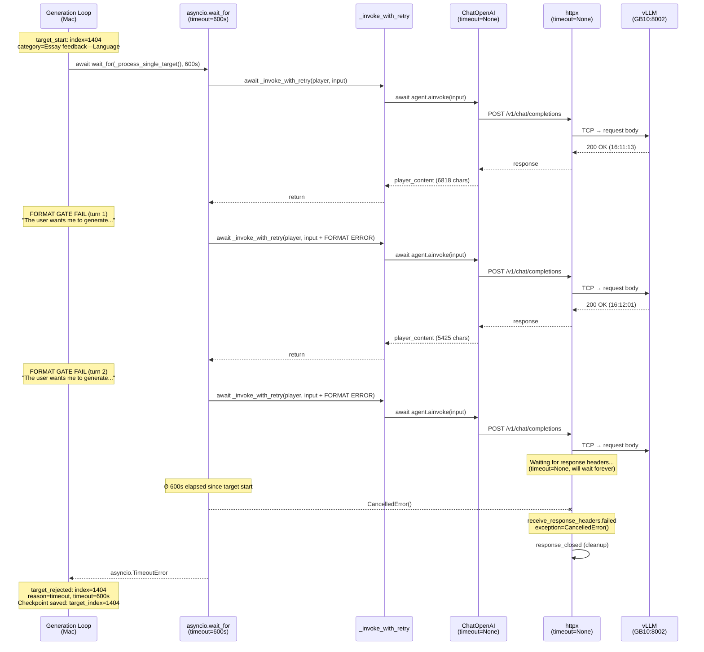
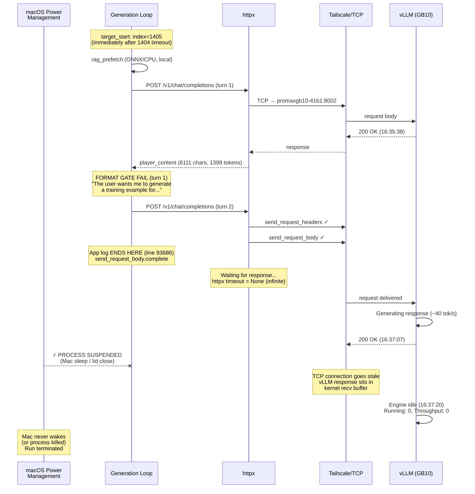
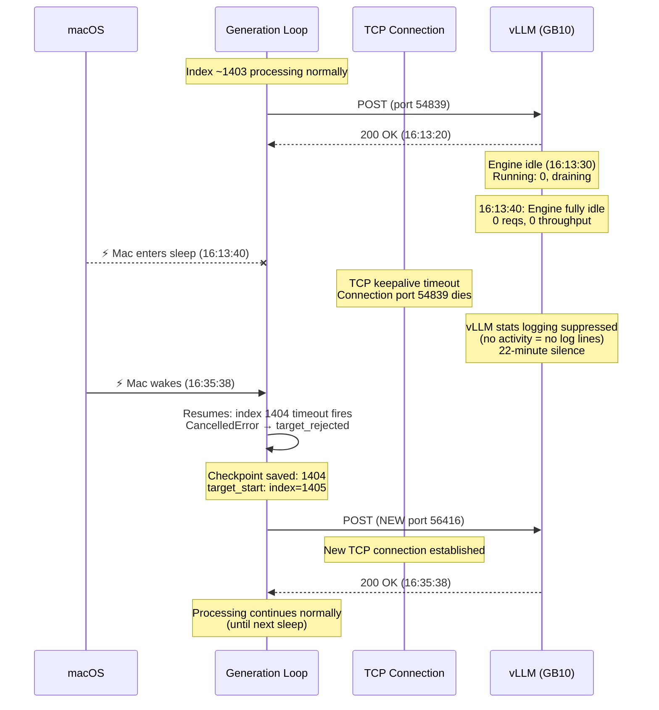

# Review Report: TASK-REV-D0A8 (Revision 2)

## Executive Summary

The 2500-target generation run stalled at index 1405 because the **host Mac process was suspended** while mid-HTTP-request to vLLM on GB10. The run experienced **two separate Mac sleep events** (65.5 min and 22 min) during the 28-hour wall-clock run. The final stall was terminal: the Mac suspended after sending an HTTP request body but before receiving the response, and never resumed.

A deeper cross-boundary analysis reveals a **compounding timeout chain failure**: LangChain's `ChatOpenAI` explicitly passes `timeout=None` to the OpenAI SDK, which **defeats the OpenAI client's built-in 600s safety net**. This means the effective HTTP timeout for all LLM calls is **infinite**. The only protection is the coarse per-target `asyncio.wait_for(timeout=600s)`, which correctly fired once (index 1404) but cannot protect against process-level suspension.

The run was further degraded by a **41% format gate failure rate** that worsened over time.

**Recommendation**: Fix-then-resume. Apply 3 targeted fixes (run on GB10, wire per-call timeout, mitigate format gate), then resume from checkpoint 1404.

---

## C4 Context Diagram: System Boundaries

```
┌─────────────────────────────────────────────────────────────────────┐
│                        Mac (Richards-MBP)                           │
│                                                                     │
│  ┌──────────────────────────────────────────────────────────────┐   │
│  │  python agent.py                                             │   │
│  │  ┌──────────────┐  ┌──────────────┐  ┌──────────────────┐   │   │
│  │  │ Generation   │  │ ChromaDB     │  │ Output Files     │   │   │
│  │  │ Loop         │  │ (ONNX/CPU)   │  │ train.jsonl      │   │   │
│  │  │              │  │              │  │ rejected.jsonl   │   │   │
│  │  │ asyncio      │  │ RAG prefetch │  │ .checkpoint      │   │   │
│  │  │ event loop   │  │ (local)      │  │                  │   │   │
│  │  └──────┬───────┘  └──────────────┘  └──────────────────┘   │   │
│  │         │                                                    │   │
│  │         │ HTTP POST (httpx, timeout=None)                    │   │
│  └─────────┼────────────────────────────────────────────────────┘   │
│            │                                                         │
│  ══════════╪══════ macOS Power Management Boundary ══════════════    │
│            │  ↑ Process SUSPENDED when lid closes / idle sleep       │
│            │  ↑ TCP connections go stale during suspension           │
└────────────┼────────────────────────────────────────────────────────┘
             │
             │ TCP over Tailscale (promaxgb10-41b1:8002)
             │
┌────────────┼────────────────────────────────────────────────────────┐
│            │               GB10 (promaxgb10-41b1)                   │
│  ┌─────────▼────────────────────────────────────────────────────┐   │
│  │  Docker: vllm-agentic-factory                                │   │
│  │  ┌───────────────┐  ┌───────────────┐  ┌────────────────┐   │   │
│  │  │ APIServer     │  │ EngineCore    │  │ GPU (NVIDIA    │   │   │
│  │  │ (uvicorn)     │  │ (pid=62)      │  │ GB10, CUDA     │   │   │
│  │  │ pid=1         │  │               │  │ 12.1)          │   │   │
│  │  │               │  │ Qwen3.5-35B   │  │                │   │   │
│  │  │ OpenAI compat │  │ -A3B-FP8      │  │ prefix cache   │   │   │
│  │  │ /v1/chat/     │  │               │  │ xgrammar       │   │   │
│  │  │ completions   │  │ 262K context  │  │                │   │   │
│  │  └───────────────┘  └───────────────┘  └────────────────┘   │   │
│  └──────────────────────────────────────────────────────────────┘   │
└─────────────────────────────────────────────────────────────────────┘
```

---

## C4 Component Diagram: Invocation Chain (Per LLM Call)

```
┌─ Generation Loop (entrypoint/generation_loop.py) ──────────────────┐
│                                                                     │
│  asyncio.wait_for(timeout=600s)  ← only active timeout             │
│    │                                                                │
│    ▼                                                                │
│  _process_single_target()                                          │
│    │                                                                │
│    ├── _invoke_with_retry(player, input, retries=3, backoff=2.0)   │
│    │     │                                                          │
│    │     ▼                                                          │
│    │   agent.ainvoke(input)  ← no per-call timeout                 │
│    │     │                                                          │
│    │     ▼                                                          │
│    │   CompiledStateGraph.ainvoke()  [LangGraph]                   │
│    │     │                                                          │
│    │     ├── MemoryMiddleware (read ./AGENTS.md)                   │
│    │     ├── PatchToolCallsMiddleware                              │
│    │     │                                                          │
│    │     ▼                                                          │
│    │   ChatOpenAI._agenerate()  [langchain-openai 1.1.12]         │
│    │     │                                                          │
│    │     │  timeout=None passed explicitly ← DEFEATS 600s DEFAULT  │
│    │     ▼                                                          │
│    │   openai.AsyncOpenAI.chat.completions.create()  [openai 2.29] │
│    │     │                                                          │
│    │     │  httpx timeout = None (infinite)                        │
│    │     ▼                                                          │
│    │   httpx.AsyncClient.post()  [httpx 0.28.1]                   │
│    │     │                                                          │
│    │     ├── send_request_headers                                  │
│    │     ├── send_request_body                                     │
│    │     ├── receive_response_headers  ← CAN BLOCK FOREVER        │
│    │     ├── receive_response_body                                 │
│    │     └── response_closed                                       │
│    │           │                                                    │
│    │           ▼                                                    │
│    │         TCP → Tailscale → GB10:8002 → vLLM                   │
│    │                                                                │
│    └── format_gate_check(player_content)                           │
│          │                                                          │
│          ├── _extract_json_object() (3-try: direct/fence/brace)    │
│          ├── json.loads() + keys check (messages, metadata)        │
│          └── IF FAIL: format_retries++ (max 3), skip Coach         │
│                                                                     │
└─────────────────────────────────────────────────────────────────────┘
```

---

## Sequence Diagram: Index 1404 Timeout (The Correctly-Handled Case)



---

## Sequence Diagram: Index 1405 Final Stall (Terminal Failure)



---

## Sequence Diagram: The 22-Minute Gap (Mac Sleep Recovery)



---

## Finding 1 (REVISED): Root Cause -- Mac Process Suspension

**Severity**: Critical

### Correction from Initial Analysis

The initial analysis identified a single 22-minute gap. The deeper investigation reveals **two Mac sleep events**:

| Gap | Time Period | Duration | vLLM Docker Evidence |
|-----|------------|----------|---------------------|
| #1 | 03-31 14:01 → 15:06 | **65.5 min** | Engine idle, port 57805 → 65455 |
| #2 | 04-01 16:13 → 16:35 | **22.0 min** | Engine idle, port 54839 → 56416 |
| Terminal | 04-01 16:37+ | **Permanent** | Engine idle, no recovery |

### Evidence Chain

1. **vLLM server ran continuously** -- prefix cache hit rate preserved across all gaps (78.7% → 78.8% across Gap #1, 82.6% → 82.6% across Gap #2), same PIDs throughout, zero restarts
2. **TCP ports change across every gap** -- old connections die during sleep, new connections opened on resume (57805→65455→...→54839→56416)
3. **vLLM log is pristine** -- zero errors in 14,410 lines, all 4,627 requests returned 200 OK, no GPU/OOM/network issues
4. **App ran on Mac** (`richardwoollcott@Richards-MBP`), not GB10 -- subject to macOS power management
5. **Afternoon timing** -- both gaps occurred in afternoon (14:01, 16:13), consistent with laptop lid-close patterns

### Why Recovery Worked for Gap #1 and #2 but Not the Terminal Stall

Gaps #1 and #2: The Mac woke up, the asyncio event loop resumed, the generation loop continued from where it left off. The httpx client automatically reconnected on a new TCP port.

Terminal stall: The Mac suspended at ~16:37 while httpx was waiting for `receive_response_headers` (app log last line: `send_request_body.complete`). vLLM processed the request and sent 200 OK at 16:37:07, but the Mac's process was already suspended. The response sat in the kernel TCP recv buffer. **The Mac either never woke up, or the user killed the process.**

---

## Finding 2 (REVISED): Compounding Timeout Chain Failure

**Severity**: Critical (latent -- worse than initially assessed)

### The Full Timeout Chain

```
Layer                        Configured      Effective       Why
─────────────────────────────────────────────────────────────────────
httpx default                5s all          OVERRIDDEN      OpenAI SDK overrides
OpenAI SDK default           600s read       DEFEATED        LangChain passes None
LangChain ChatOpenAI         request_timeout NONE            Default is None
  ↳ passes timeout=None      =None
  ↳ OpenAI sees None as
    "disable timeout"
    (not NotGiven sentinel)
App model_factory.py         (not passed)    inherits None   No timeout kwarg
App config llm_timeout       300s            DEAD CONFIG     Never wired to client
App target_timeout           600s            ✓ ACTIVE        asyncio.wait_for()
─────────────────────────────────────────────────────────────────────
EFFECTIVE: Individual HTTP calls have NO timeout.
           Only per-target 600s timeout provides protection.
```

### The LangChain Sentinel Bug (Key New Finding)

The OpenAI Python SDK uses a `NotGiven` sentinel pattern:

```python
# openai/_client.py
class AsyncOpenAI:
    def __init__(self, timeout: float | Timeout | None | NotGiven = NOT_GIVEN):
        if is_given(timeout):
            self.timeout = timeout      # ← None means "no timeout"
        else:
            self.timeout = DEFAULT_TIMEOUT  # ← 600s safety net
```

LangChain's `ChatOpenAI` (v1.1.12) does this:

```python
# langchain_openai/chat_models/base.py
class ChatOpenAI:
    request_timeout: float | None = Field(default=None)

    def _get_client(self):
        return openai.AsyncOpenAI(
            timeout=self.request_timeout,  # ← passes None, not NOT_GIVEN
            ...
        )
```

Because `None` is not `NOT_GIVEN`, the OpenAI SDK treats it as an explicit "disable timeout" instruction. The 600s safety net is bypassed.

### Consequence

Without per-call timeouts, a single hung vLLM connection blocks the generation loop indefinitely. The per-target 600s timeout provides a coarse safety net but:
- Burns the entire target budget on a single stuck call
- Cannot distinguish between "slow generation" and "hung connection"
- Only fires once per target (the generation loop may have used turns 1-2 before the stuck call)

---

## Finding 3 (REVISED): Format Gate Failure Analysis -- Structured Output is NOT Viable for Player

**Severity**: High (primary throughput bottleneck)

### Statistics (unchanged)
- 1,165 format gate failures (~41% rate)
- Worsening: Q1 24.1% → Q4 28.0%
- 99.6% produce plain English reasoning text ("The user wants me to generate...")
- 61 indices (8.6%) never recovered after max retries

### CORRECTION: Structured Output for Player is Architecturally Incompatible

The initial review recommended enabling vLLM xgrammar structured output for the Player (Option 3a). **This recommendation is withdrawn** after historical analysis and cross-boundary validation. The Player cannot use structured output for four compounding reasons:

**1. Tool calling conflict (blocking).** The Player uses `rag_retrieval` in an agentic loop (`tools=[rag_retrieval]`). vLLM structured output is applied server-side to **every** completion request, including intermediate tool-call turns. When the Player makes a tool call, its response is a `tool_calls` message, not JSON. Structured output would reject this response.

**2. Variable-length messages array (blocking).** Single-turn examples have 3 messages; multi-turn essay feedback has 5-7+. JSON Schema can express `"type": "array"` but cannot enforce the strict role-alternation pattern (system, then user/assistant alternating) that the Pydantic `model_validator` enforces. xgrammar would allow invalid orderings.

**3. Prose quality degradation (high risk).** The Player's core value is in `content` string fields containing paragraphs of Socratic dialogue and `<think>` reasoning blocks. xgrammar's token-level constraints modify the sampling distribution at each step. For the Coach's short, structured `CoachVerdict`, this is appropriate. For the Player's multi-hundred-token prose passages, this risks quality degradation.

**4. `<think>` blocks cannot be schema-enforced.** JSON Schema has no mechanism to require `<think>...</think>` inside a string value. xgrammar adds cost (constrained sampling) without benefit.

### Historical Precedent: Explicit Architectural Decision

This is not a new finding -- there is an **explicit, documented decision** not to use structured output for the Player:

| Document | Decision |
|----------|----------|
| **TASK-LR1-001** (completed 2026-03-30) | "Do NOT apply guided_json to the Player — Player outputs nested JSON containing free-form conversation content with think blocks, which would be broken by schema constraints" |
| **TASK-REV-649A** (Long Run 1 review) | "Enable vLLM guided_json for Coach... **Do NOT apply to Player** (Player outputs nested JSON with free-form conversation content including think blocks)" |
| **TASK-REV-TPF1** (params-fix review) | "Option 1 [structured output for Player] risks constraining multi-turn conversation generation." Recommended prompting first. |
| **TASK-OR-004** (archived) | Structured output proposal scoped to Coach only. Lists 3 vLLM bugs affecting Qwen3.5 xgrammar. |

### Historical Precedent: Prompt Engineering Backfired

The alternative of stronger Player prompting was tried and **caused a 22.1pp acceptance regression** (TASK-REV-FPF1):

| Run | Non-JSON output | JSON without metadata | Unclosed think blocks |
|-----|----------------|----------------------|----------------------|
| Baseline (TPF1) | 44 extraction fails | 0 | 4 |
| With stronger prompt | 68 format gates (+54%) | 22 (NEW failure mode) | 14 (+250%) |

TASK-FPF1-001 reverted these harmful prompt changes. The lesson: adding BAD/GOOD examples or "do not think out loud" instructions **primes the model to replicate the bad pattern**.

### What Remains: The Existing Multi-Layer Defence

The current mitigation stack (implemented via TASK-FPF1-001/002/003) is the architecturally correct approach:

```
Layer 1: Prompt instructions ("CRITICAL — Response Format: ONLY JSON")
Layer 2: _extract_json_object() — 3-try strategy (direct / code-fence / brace-match)
Layer 3: _repair_json_strings() — escape literal newlines/tabs in JSON strings
Layer 4: Format gate — validate messages + metadata keys BEFORE Coach
Layer 5: Decoupled format retries (max_format_retries=3, separate from Coach turns)
Layer 6: FORMAT ERROR feedback — explicit instruction to produce JSON
Layer 7: Coach evaluation — final semantic quality gate
```

This stack successfully recovers ~60% of format failures on first retry. The 41% failure rate causes throughput waste but does not affect output quality (only accepted examples are written).

---

## Finding 4: vLLM Server Performance is Excellent

**Severity**: Informational (positive)

| Metric | Value |
|--------|-------|
| Total requests | 4,627 |
| Errors | **0** |
| HTTP 200 OK rate | **100%** |
| GPU errors | None |
| OOM events | None |
| Generation throughput | ~40 tok/s (consistent) |
| Prefix cache hit rate | 82.6% (final) |
| Engine utilization | 98.2% (when client active) |
| Total idle from Mac sleep | ~87.5 min (5.2% wall-clock) |

The vLLM container on GB10 is performing flawlessly. The entire problem is client-side.

---

## Finding 5: Framework Architecture (New Finding)

### Project Does Not Use `create_deep_agent()`

The project imports DeepAgents v0.5.0a2 but bypasses `create_deep_agent()` for both Player and Coach. Instead, it calls `langchain.agents.create_agent()` directly:

```python
# agents/player.py -- creates Player via LangChain directly
from langchain.agents import create_agent

# agents/coach.py -- creates Coach via LangChain directly
from langchain.agents import create_agent
```

**Reason**: `create_deep_agent()` unconditionally injects `FilesystemMiddleware` with 8 filesystem tools. The Coach must have zero tools (D5 invariant), so the project uses the lower-level API.

**Implication**: DeepAgents' own middleware stack (TodoList, SubAgent, Summarization) is not active. The project uses a subset: `MemoryMiddleware`, `PatchToolCallsMiddleware`, and `AnthropicPromptCachingMiddleware`.

### Invocation Chain (Validated Against Source)

```
_invoke_with_retry() [generation_loop.py:366]
  → agent.ainvoke(input) [line 399]
    → CompiledStateGraph.ainvoke() [LangGraph]
      → MemoryMiddleware (reads ./AGENTS.md)
      → PatchToolCallsMiddleware
      → ChatOpenAI._agenerate() [langchain-openai 1.1.12]
        → openai.AsyncOpenAI.chat.completions.create() [openai 2.29.0]
          → httpx.AsyncClient.post() [httpx 0.28.1, timeout=None]
            → TCP to promaxgb10-41b1:8002 via Tailscale
```

---

## Revised Recommendations

### Option A: Fix-Then-Resume (Recommended)

**Fix 1 (Critical): Run on GB10, not Mac**

Run the generation loop directly on GB10 via SSH + `tmux`:

```bash
ssh promaxgb10-41b1
tmux new -s factory
cd /path/to/agentic-dataset-factory
python agent.py --resume
# Ctrl-B D to detach
```

This eliminates Mac sleep entirely. The localhost connection to vLLM (127.0.0.1:8002 vs Tailscale) also removes network latency and TCP stale-connection risk.

**Fix 2 (Critical): Wire per-call HTTP timeout**

The fix must work around LangChain's `None` passthrough. Two approaches:

```python
# Approach A: Pass timeout to init_chat_model (preferred)
model = init_chat_model(
    config.model,
    model_provider="openai",
    timeout=config.llm_timeout,  # 300s → overrides LangChain's None
    ...
)

# Approach B: Wrap ainvoke with asyncio.wait_for per-call
async def _invoke_with_timeout(agent, input_data, timeout):
    return await asyncio.wait_for(agent.ainvoke(input_data), timeout=timeout)
```

Approach A is cleaner but needs validation that `init_chat_model` passes `timeout` through to `ChatOpenAI`. Approach B is a guaranteed fix.

**Fix 3 (Medium-impact): Reduce format gate failures via temperature reduction**

Lower Player temperature from 0.6 → 0.3-0.4. Rationale:
- The failure mode ("The user wants me to generate...") is the model's reasoning/chain-of-thought leaking into the visible response
- Lower temperature reduces creative "thinking aloud" behavior and increases probability of starting the response with `{`
- This is the **safest lever** -- no architectural conflict, no prompt changes (which backfired in TASK-FPF1-001), no structured output (which is incompatible with Player's tool-calling agentic loop)
- Can be A/B tested: run 50 targets at temp=0.4, compare format gate rate vs baseline 41%

**Rejected alternatives** (with rationale):

| Option | Status | Why Rejected |
|--------|--------|-------------|
| Structured output for Player (xgrammar) | **REJECTED** | Incompatible: tool calls, variable messages, prose quality, explicit architectural decision (TASK-LR1-001, TASK-REV-649A) |
| Stronger Player prompt (BAD/GOOD examples) | **REJECTED** | PROVEN HARMFUL: caused 22.1pp acceptance regression in TASK-FPF1, reverted in TASK-FPF1-001 |
| "Do not think out loud" instruction | **REJECTED** | Part of the prompt changes that caused regression in TASK-FPF1 |
| Disable model reasoning | **REJECTED** | Binding decision from Run 5 (TASK-REV-7617): "DO NOT disable Coach reasoning" — same principle applies to Player |

**Future investigation** (deferred, not blocking resume):

| Option | Potential | Risk | When |
|--------|-----------|------|------|
| Configure vLLM reasoning parser for Qwen3.5 (`--reasoning-parser`) | Could channel "The user wants me to..." into hidden reasoning stream | Medium — Qwen3.5 reasoning parser support unvalidated on GB10 | After 2500-run completes |
| Response prefix / assistant prefill (`{"` as first tokens) | Could bias model toward JSON start | Low — but vLLM chat API may not support prefill cleanly | After 2500-run completes |
| Increase `max_format_retries` from 3 to 5 | More recovery opportunities per target | Low — costs extra LLM calls on failing targets | Quick config change if needed |

### Decision Matrix (Revised)

| Option | Fixes | Time to Resume | Stall Risk | Format Gate | Total ETA |
|--------|-------|---------------|------------|-------------|-----------|
| **A: Fix-then-resume** | GB10 + timeout + temp | 2-3 hours | Eliminated | ~25-30% est. | **18-22 hours** |
| B: Resume as-is on GB10 | GB10 only | 30 min | Eliminated | 41%+ rate | 22+ hours |
| C: Resume as-is on Mac | None | Immediate | HIGH | 41%+ rate | Unknown (stalls likely) |

---

## Implementation Tasks (Created)

| Task | Description | Wave | Mode | Status |
|------|-------------|------|------|--------|
| **TASK-D0A8-001** | Wire per-call LLM timeout (fix LangChain `None` passthrough) | 1 | task-work | backlog |
| **TASK-D0A8-002** | Reduce Player temperature 0.6 → 0.4 | 1 | direct | backlog |
| **TASK-D0A8-003** | GB10 setup instructions + tmux run script | 1 | task-work | backlog |
| **TASK-D0A8-005** | Write learnings document (historical analysis) | 1 | direct | backlog |
| **TASK-D0A8-004** | Resume generation from checkpoint 1404 on GB10 | 2 | manual | backlog |

**Feature folder**: `tasks/backlog/2500-run-stall-fixes/`
**Learnings doc**: `docs/learnings/2500-run-stall-analysis.md`

### Constraints for Implementation Tasks

Any implementation MUST comply with the following architectural decisions established in prior reviews:

| Constraint | Source | Impact |
|-----------|--------|--------|
| Do NOT apply structured output to Player | TASK-LR1-001, TASK-REV-649A | TASK-D0A8-002 must NOT add `extra_body` to Player |
| Do NOT add BAD/GOOD examples to Player prompt | TASK-FPF1-001 (revert) | No prompt engineering beyond existing "CRITICAL — Response Format" |
| Coach reasoning must stay ENABLED | Run 5 decision (TASK-REV-7617) | No `enable_thinking: false` changes |
| Format retries decoupled from Coach turns | TASK-FPF1-003 | TASK-D0A8-001 must not regress the while-loop restructure |
| Checkpoint resume via append mode | ADR-ARCH-010 | TASK-D0A8-003 must use `--resume` flag |

---

## Appendix A: Validated Timeout Chain

| Layer | Package | Version | Config | Effective | Source File |
|-------|---------|---------|--------|-----------|-------------|
| httpx | httpx | 0.28.1 | `Timeout(5.0)` | Overridden by OpenAI | `_config.py:246` |
| OpenAI | openai | 2.29.0 | `Timeout(600, connect=5)` | Defeated by LangChain | `_constants.py:9` |
| LangChain | langchain-openai | 1.1.12 | `request_timeout=None` | **None (infinite)** | `base.py:646` |
| App model | model_factory.py | -- | (not passed) | Inherits None | `model_factory.py:35` |
| App config | config/models.py | -- | `llm_timeout=300` | **Dead config** | `models.py:137` |
| App target | generation_loop.py | -- | `target_timeout=600` | **Active** | `generation_loop.py:1113` |

## Appendix B: Key Log Correlations

| App Log Line | Time (UTC) | Docker Log Line | Event |
|-------------|------------|-----------------|-------|
| 93595 | ~16:10 | -- | target_start: index=1404 |
| 93606 | 16:11:13 | ~14375 | 1404 turn 1 response, format gate fail |
| 93630 | 16:12:01 | ~14386 | 1404 turn 2 response, format gate fail |
| 93650 | ~16:13 | 14393 | 1404 turn 3 CancelledError (target timeout) |
| 93653 | ~16:13 | 14394-14395 | target_rejected, engine goes idle |
| -- | 16:13:40 - 16:35:40 | 14395-14396 | **22-min Mac sleep (Gap #2)** |
| 93655 | ~16:35 | 14396 | target_start: index=1405 |
| 93674 | 16:35:38 | 14400 | 1405 turn 1 response, format gate fail |
| 93686 | ~16:36 | 14405 | 1405 turn 2 request sent (LAST APP LOG LINE) |
| -- | 16:37:07 | 14407 | vLLM returns 200 OK (app never receives) |
| -- | 16:37:20 | 14409 | vLLM engine permanently idle |

## Appendix C: Gap #1 Evidence

| Docker Line | Time | Event |
|-------------|------|-------|
| 922 | 03-31 14:00:53 | Last POST 200 OK (port 57805) |
| 923 | 03-31 14:01:03 | Engine draining (0 reqs, 11.3 gen tps) |
| 924 | 03-31 14:01:13 | Engine idle (0/0) |
| 925 | 03-31 15:06:43 | New request arrives (port 65455) |
| | | **Gap: 65.5 minutes** |

Prefix cache preserved: 78.7% → 78.8% (no container restart).
