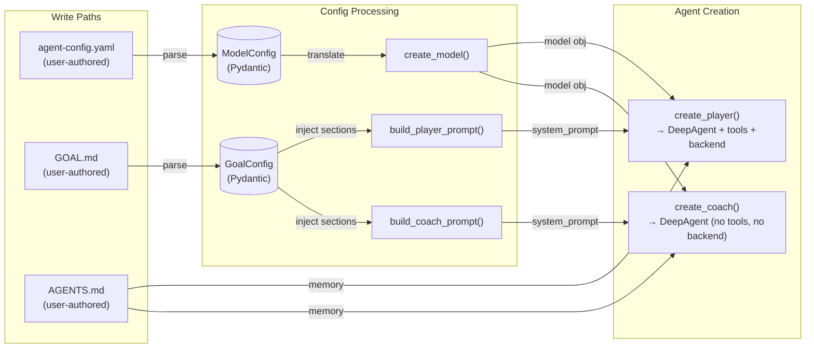
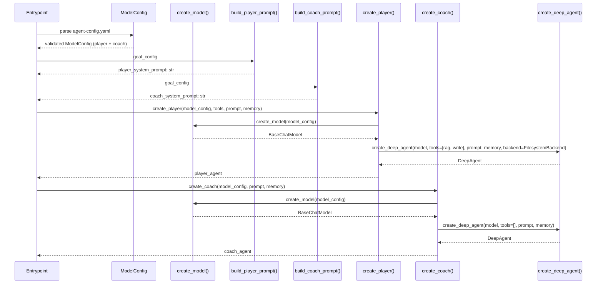
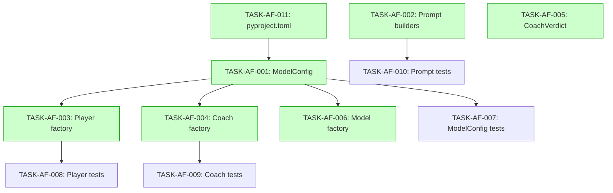

# Implementation Guide: Agent Factories — Player and Coach

## Approach

**Option C: Hybrid — Contract Signatures + Extracted Model Factory**

The factory signatures match the published API contract (`API-generation.md`). Model creation is extracted into a shared `agents/model_factory.py` module to prevent duplication (DRY). The Coach factory structurally enforces D5 (no tools parameter in signature).

## Key Architectural Decisions

1. **ModelConfig as Pydantic BaseModel** (not dataclass) — field validators for temperature range, conditional endpoint
2. **Prompt builders in `prompts/`** — factories receive pre-built `system_prompt: str`
3. **Shared model factory** — `create_model(config) -> BaseChatModel` in `agents/model_factory.py`
4. **Coach has NO `tools` parameter** — structural enforcement of role separation
5. **FilesystemBackend restricted to `agents/player.py`** — module-level import check in tests

## Data Flow: Read/Write Paths



_All write paths (user config files) have corresponding read paths through the processing layer into agent creation. No disconnected paths._

## Integration Contracts



_The entrypoint orchestrates config parsing, prompt building, and factory calls. Data flows unidirectionally from config → processing → agent creation._

## §4: Integration Contracts

### Contract: ModelConfig
- **Producer task:** TASK-AF-001
- **Consumer task(s):** TASK-AF-003, TASK-AF-004, TASK-AF-006
- **Artifact type:** Python class (Pydantic BaseModel)
- **Format constraint:** Must have `provider`, `model`, `endpoint`, `temperature` fields matching `DM-agent-config.md`
- **Validation method:** Consumer tests import `ModelConfig` and verify field access; Pydantic validation catches invalid values

### Contract: create_model() return type
- **Producer task:** TASK-AF-006
- **Consumer task(s):** TASK-AF-003, TASK-AF-004
- **Artifact type:** Function return value (`BaseChatModel`)
- **Format constraint:** Must return a LangChain `BaseChatModel` instance compatible with `create_deep_agent` model parameter
- **Validation method:** Factory tests mock `create_model` and verify the return value is passed to `create_deep_agent`

### Contract: GoalConfig sections
- **Producer task:** Domain Config feature (external dependency)
- **Consumer task(s):** TASK-AF-002
- **Artifact type:** Python class with section accessors
- **Format constraint:** Must provide named sections (goal, system_prompt, generation_guidelines, evaluation_criteria, output_schema, metadata_schema, layer_routing) as non-empty strings
- **Validation method:** Prompt builder tests use mock GoalConfig; prompt builder validates sections are non-empty before concatenation

## Task Dependencies



_Tasks with green background can run in parallel within the same wave._

## Execution Strategy

### Wave 1: Foundation (4 tasks — parallel)
| Task | Name | Complexity | Mode |
|------|------|-----------|------|
| TASK-AF-011 | pyproject.toml updates | 1 | direct |
| TASK-AF-001 | ModelConfig Pydantic model | 3 | task-work |
| TASK-AF-002 | Prompt builder module | 4 | task-work |
| TASK-AF-005 | CoachVerdict Pydantic model | 2 | task-work |

### Wave 2: Factories + Tests (5 tasks — parallel)
| Task | Name | Complexity | Mode |
|------|------|-----------|------|
| TASK-AF-003 | Player factory | 3 | task-work |
| TASK-AF-004 | Coach factory | 3 | task-work |
| TASK-AF-006 | Shared model factory | 3 | task-work |
| TASK-AF-007 | ModelConfig unit tests | 3 | task-work |
| TASK-AF-010 | Prompt builder unit tests | 3 | task-work |

### Wave 3: Factory Tests (2 tasks — parallel)
| Task | Name | Complexity | Mode |
|------|------|-----------|------|
| TASK-AF-008 | Player factory unit tests | 3 | task-work |
| TASK-AF-009 | Coach factory unit tests | 3 | task-work |

## File Structure

```
agentic-dataset-factory/
├── config/
│   ├── __init__.py
│   ├── models.py              # ModelConfig (TASK-AF-001)
│   └── coach_verdict.py       # CoachVerdict (TASK-AF-005)
├── agents/
│   ├── __init__.py
│   ├── model_factory.py       # create_model() (TASK-AF-006)
│   ├── player.py              # create_player() (TASK-AF-003)
│   └── coach.py               # create_coach() (TASK-AF-004)
├── prompts/
│   ├── __init__.py
│   ├── player_prompts.py      # build_player_prompt() (TASK-AF-002)
│   └── coach_prompts.py       # build_coach_prompt() (TASK-AF-002)
└── tests/
    ├── test_model_config.py   # TASK-AF-007
    ├── test_player_factory.py # TASK-AF-008
    ├── test_coach_factory.py  # TASK-AF-009
    └── test_prompt_builders.py # TASK-AF-010
```

## Risk Mitigations

| Risk | Mitigation | Task |
|------|-----------|------|
| Coach gets tools | No `tools` param in `create_coach` signature | TASK-AF-004, TASK-AF-009 |
| Coach gets FilesystemBackend | Module-level import check in tests | TASK-AF-009 |
| Partial GOAL.md prompt | Prompt builders validate all sections non-empty | TASK-AF-002, TASK-AF-010 |
| criteria_met key mismatch | Coach prompt includes all criterion names | TASK-AF-002, TASK-AF-010 |
| Model creation duplication | Shared `create_model()` function | TASK-AF-006 |
| Temperature out of range | Pydantic `Field(ge=0.0, le=2.0)` | TASK-AF-001, TASK-AF-007 |
| DeepAgents API mismatch | Verify `create_deep_agent` signature before impl | TASK-AF-003, TASK-AF-004 |

## Testing Strategy

- **Complexity-adaptive**: Each task's testing depth matches its complexity
- **Factory tests**: Mock `create_deep_agent` at import site, inspect `call_args`
- **ModelConfig tests**: Cover all BDD boundary/negative scenarios with `pytest.raises`
- **Prompt tests**: Use mock GoalConfig to verify section injection
- **Module-level checks**: Verify import presence/absence for role separation enforcement
