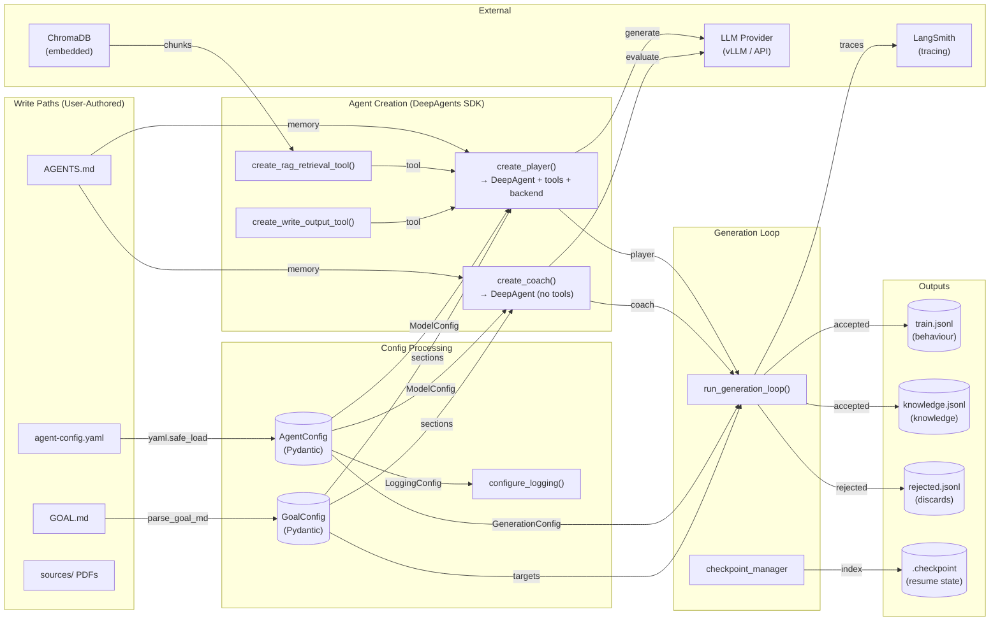
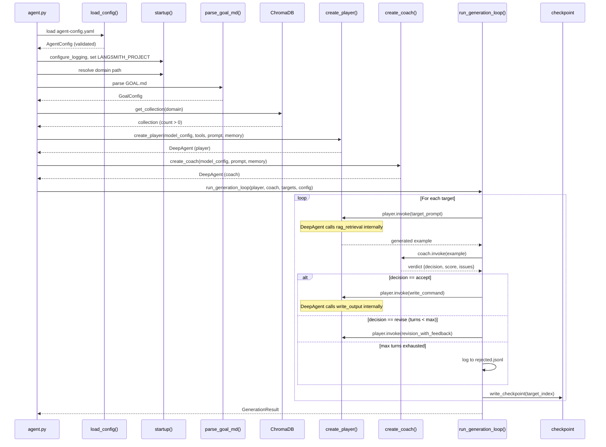
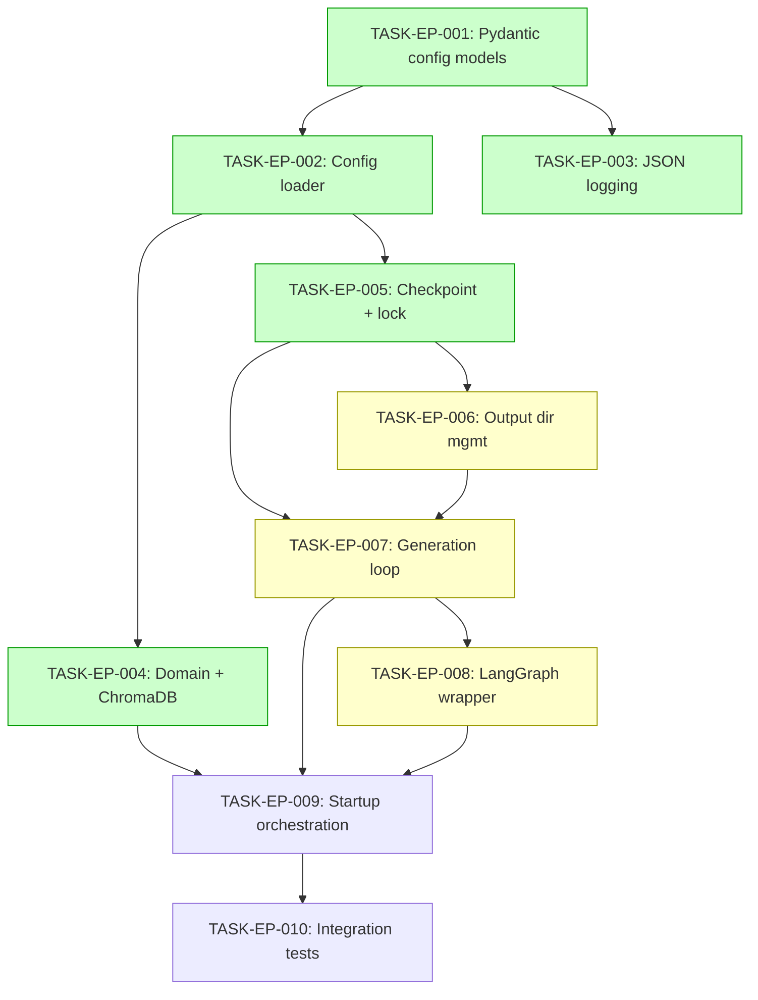

# Implementation Guide: Entrypoint — Config Loading, Validation, and Generation Loop Orchestration

## Approach

**Pydantic Config + DeepAgents SDK Orchestration**

The entrypoint (`agent.py`) orchestrates config loading via Pydantic models, delegates agent creation to DeepAgents `create_deep_agent()` factories, and runs the sequential Player-Coach generation loop as plain Python. LangGraph provides a thin runtime wrapper for `langgraph dev` / Docker Compose execution.

## Key Architectural Decisions

1. **Pydantic for config validation** — declarative validators cover all DM-agent-config.md rules
2. **DeepAgents SDK for agent lifecycle** — `create_deep_agent()` manages tool calling, conversation, and memory
3. **Plain Python generation loop** — NOT LangGraph nodes; the entrypoint iterates targets and orchestrates Player/Coach invocations
4. **LangGraph as thin wrapper** — `graph` export for `langgraph.json` compatibility, not for loop control
5. **ADR-ARCH-010 resilience** — retry at LangChain model level, per-target timeout via `asyncio.wait_for`, checkpoint via atomic file write
6. **ModelConfig shared** — imported from `config/models.py` (shared with agent-factories feature, TASK-AF-001)

## Data Flow: Read/Write Paths



_All write paths (user config files, source documents) have corresponding read paths through config processing, agent creation, and the generation loop into outputs. No disconnected paths._

## Integration Contracts



_Data flows unidirectionally from config → startup → agent creation → generation loop → outputs. DeepAgents SDK manages tool calling internally — the loop orchestrates at the target level._

## §4: Integration Contracts

### Contract: AgentConfig
- **Producer task:** TASK-EP-001
- **Consumer task(s):** TASK-EP-002, TASK-EP-004, TASK-EP-007, TASK-EP-009
- **Artifact type:** Python class (Pydantic BaseModel)
- **Format constraint:** Must have `domain`, `player` (ModelConfig), `coach` (ModelConfig), `generation` (GenerationConfig), `chunking` (ChunkingConfig), `logging` (LoggingConfig) fields
- **Validation method:** Consumer tests import `AgentConfig` and verify field access; Pydantic validation catches invalid values

### Contract: ModelConfig (shared with agent-factories)
- **Producer task:** TASK-AF-001 (agent-factories feature)
- **Consumer task(s):** TASK-EP-001 (imports into AgentConfig), TASK-EP-009 (passes to agent factories)
- **Artifact type:** Python class (Pydantic BaseModel)
- **Format constraint:** Must have `provider`, `model`, `endpoint`, `temperature` fields matching DM-agent-config.md
- **Validation method:** Import from `config.models`; Pydantic validation enforces constraints

### Contract: GoalConfig sections
- **Producer task:** TASK-DC-001..005 (goal-md-parser feature)
- **Consumer task(s):** TASK-EP-009 (passes to prompt builders and target generation)
- **Artifact type:** Python class with section accessors
- **Format constraint:** Must provide named sections as non-empty strings; must provide generation targets as list of GenerationTarget
- **Validation method:** Protocol/ABC interface with required methods

### Contract: DeepAgent instances
- **Producer task:** TASK-AF-003 (create_player), TASK-AF-004 (create_coach)
- **Consumer task(s):** TASK-EP-007 (generation loop), TASK-EP-009 (startup orchestration)
- **Artifact type:** DeepAgent objects from `create_deep_agent()`
- **Format constraint:** Player has tools=[rag_retrieval, write_output] + FilesystemBackend; Coach has tools=[] and no backend
- **Validation method:** Generation loop invokes `.invoke()` on both agents; factory tests verify tool assignments

### Contract: Checkpoint file
- **Producer task:** TASK-EP-005 (checkpoint writer)
- **Consumer task(s):** TASK-EP-005 (checkpoint reader on --resume), TASK-EP-009 (startup orchestration)
- **Artifact type:** File (`output/.checkpoint`)
- **Format constraint:** Plain text file containing a single integer (last completed target index)
- **Validation method:** Reader parses integer; error if file missing on --resume or content not parseable

## Task Dependencies



_Green tasks can run in parallel within their wave. Yellow tasks are new/changed paths._

## Execution Strategy

### Wave 1: Foundation (3 tasks — parallel)
| Task | Name | Complexity | Mode |
|------|------|-----------|------|
| TASK-EP-001 | Pydantic config models | 3 | task-work |
| TASK-EP-002 | Config loader | 3 | task-work |
| TASK-EP-003 | Structured JSON logging | 2 | direct |

### Wave 2: Startup Services (3 tasks — parallel)
| Task | Name | Complexity | Mode |
|------|------|-----------|------|
| TASK-EP-004 | Domain resolution + ChromaDB check | 3 | task-work |
| TASK-EP-005 | Checkpoint/resume + lock file | 4 | task-work |
| TASK-EP-006 | Output directory management | 2 | direct |

### Wave 3: Core Loop (2 tasks — sequential)
| Task | Name | Complexity | Mode |
|------|------|-----------|------|
| TASK-EP-007 | Generation loop (Player-Coach cycle) | 6 | task-work |
| TASK-EP-008 | LangGraph thin wrapper | 3 | task-work |

### Wave 4: Integration (2 tasks — sequential)
| Task | Name | Complexity | Mode |
|------|------|-----------|------|
| TASK-EP-009 | agent.py startup orchestration | 4 | task-work |
| TASK-EP-010 | Integration tests (BDD smoke) | 4 | task-work |

## External Dependencies

This feature depends on modules from other planned features:

| External Feature | Tasks Used | Status |
|-----------------|------------|--------|
| Agent Factories | TASK-AF-001 (ModelConfig), TASK-AF-003 (create_player), TASK-AF-004 (create_coach) | Planned |
| LangChain Tools | TASK-LCT-002 (rag_retrieval), TASK-LCT-003 (write_output) | Planned |
| GOAL.md Parser | TASK-DC-001..005 (parse_goal_md, GoalConfig) | Planned |

**Strategy**: Define Protocol/ABC interfaces for external dependencies. Implement against interfaces, stub for testing. Wire real implementations when external features complete.

## File Structure

```
agentic-dataset-factory/
├── agent.py                        # Entrypoint + graph export (TASK-EP-009, TASK-EP-008)
├── langgraph.json                  # {"graphs": {"agent": "agent.py:graph"}}
├── config/
│   ├── __init__.py
│   ├── models.py                   # AgentConfig, GenerationConfig, etc. (TASK-EP-001)
│   ├── loader.py                   # load_config() (TASK-EP-002)
│   ├── logging.py                  # configure_logging() (TASK-EP-003)
│   └── exceptions.py               # ConfigValidationError, DomainNotFoundError
├── entrypoint/
│   ├── __init__.py
│   ├── startup.py                  # Domain resolution, ChromaDB check (TASK-EP-004)
│   ├── checkpoint.py               # Checkpoint read/write (TASK-EP-005)
│   ├── lockfile.py                 # Lock file guard (TASK-EP-005)
│   ├── output.py                   # Output directory management (TASK-EP-006)
│   └── generation_loop.py          # run_generation_loop() (TASK-EP-007)
└── tests/
    ├── test_config_models.py        # TASK-EP-001 unit tests
    ├── test_config_loader.py        # TASK-EP-002 unit tests
    ├── test_checkpoint.py           # TASK-EP-005 unit tests
    ├── test_entrypoint.py           # TASK-EP-009 + TASK-EP-010 integration
    └── test_generation_loop.py      # TASK-EP-007 + TASK-EP-010 integration
```

## Risk Mitigations

| Risk | Mitigation | Task |
|------|-----------|------|
| Lock file race condition | `fcntl.flock()` — OS-level locking | TASK-EP-005 |
| Checkpoint corruption on kill | Atomic write (tmp + rename) | TASK-EP-005 |
| LLM timeout blocking loop | `asyncio.wait_for()` per target | TASK-EP-007 |
| Config edge cases | Pydantic validators cover all DM rules | TASK-EP-001 |
| Unknown YAML fields | `ConfigDict(extra="ignore")` + warning | TASK-EP-001 |
| YAML injection | `yaml.safe_load` exclusively (ASSUM-005) | TASK-EP-002 |
| External feature not ready | Protocol/ABC interfaces for stubs | TASK-EP-009 |
| DeepAgents API mismatch | Verify `create_deep_agent` signature before impl | TASK-EP-007 |
