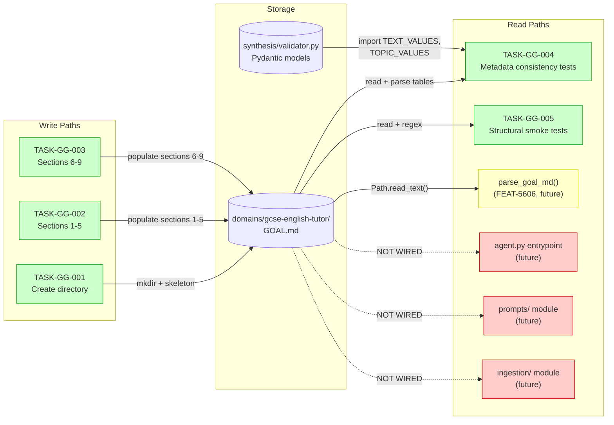
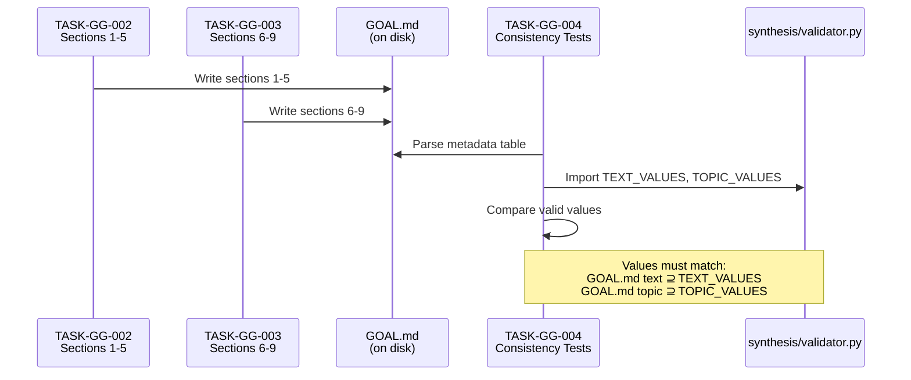
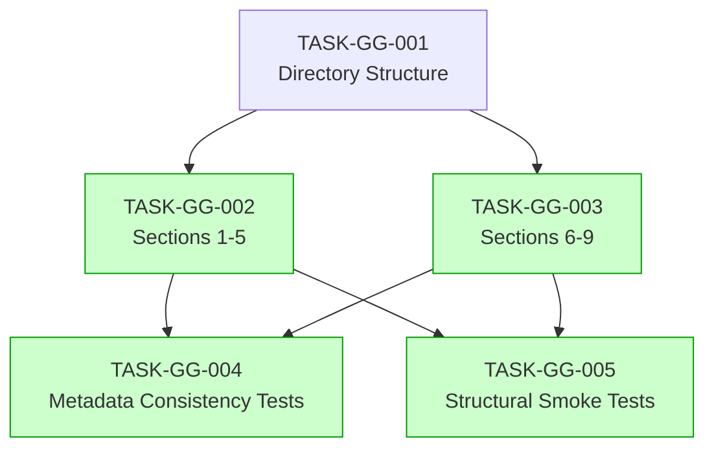

# Implementation Guide: GCSE English Tutor GOAL.md — First Domain Configuration

> Feature: FEAT-GG | Review: TASK-REV-843F
> Approach: Authoring-Only (write GOAL.md + validation tests)

## Architecture Overview

This feature creates the first concrete domain configuration — a pure markdown file at `domains/gcse-english-tutor/GOAL.md` consumed by 6 downstream modules. No Python code is produced for the GOAL.md itself; the validation tests ensure content consistency with the existing Pydantic models in `synthesis/validator.py`.

```
domains/gcse-english-tutor/
├── GOAL.md              ← 9 required sections (this feature)
├── golden_set.jsonl     ← optional, future work
└── sources/
    ├── .gitkeep
    └── (PDFs added separately, gitignored)
```

## Data Flow: Read/Write Paths



_Green = this feature. Yellow = planned (FEAT-5606). Red = future features (not yet planned)._

**Disconnection Alert**: 3 read paths (R4, R5, R6) have no caller yet. These are expected — they will be wired when the entrypoint, prompts, and ingestion modules are implemented in future features. This GOAL.md is the foundation they will consume.

## Integration Contracts



_Shows the cross-validation contract between GOAL.md content and existing Pydantic models._

## Task Dependencies



_Tasks with green background can run in parallel within their wave._

## §4: Integration Contracts

### Contract: METADATA_VALID_VALUES
- **Producer task:** TASK-GG-003 (Sections 6-9, specifically the Metadata Schema table)
- **Consumer task(s):** TASK-GG-004 (Metadata consistency tests)
- **Artifact type:** Markdown table rows in GOAL.md
- **Format constraint:** Text and topic valid values in the GOAL.md Metadata Schema table must be a superset of the `Literal` values defined in `synthesis/validator.py`'s `Metadata` model. Specifically: every value in `TEXT_VALUES` must appear in the GOAL.md `text` field's Valid Values column, and every value in `TOPIC_VALUES` must appear in the `topic` field's Valid Values column.
- **Validation method:** TASK-GG-004 pytest tests parse the GOAL.md table and assert `set(TEXT_VALUES).issubset(goal_md_text_values)` and `set(TOPIC_VALUES).issubset(goal_md_topic_values)`.

### Contract: GOAL_MD_STRUCTURE
- **Producer task:** TASK-GG-002 and TASK-GG-003 (complete GOAL.md content)
- **Consumer task(s):** TASK-GG-005 (Structural smoke tests)
- **Artifact type:** Markdown file on disk
- **Format constraint:** Must contain exactly 9 `## Section` headings matching the names defined in `docs/design/contracts/API-domain-config.md`. Generation Targets table must sum to 1,000. Reasoning split must be >= 70%.
- **Validation method:** TASK-GG-005 pytest tests use regex to find section headings and parse table rows to sum counts.

## Execution Strategy

### Wave 1: Content Authoring (3 tasks)

| Task | Description | Complexity | Mode | Parallel |
|------|-------------|-----------|------|----------|
| TASK-GG-001 | Create directory structure + skeleton | 3 | direct | Foundation |
| TASK-GG-002 | Sections 1-5 content | 5 | task-work | After GG-001 |
| TASK-GG-003 | Sections 6-9 content | 5 | task-work | After GG-001 |

**Execution:** TASK-GG-001 runs first (direct mode, ~15 min). Then TASK-GG-002 and TASK-GG-003 can run in parallel — they write to different sections of the same file, but since TASK-GG-001 creates the skeleton with all 9 headings, each task fills in its own sections without conflict.

### Wave 2: Validation Tests (2 tasks — parallel)

| Task | Description | Complexity | Mode | Parallel |
|------|-------------|-----------|------|----------|
| TASK-GG-004 | Metadata consistency tests | 4 | task-work | ✅ |
| TASK-GG-005 | Structural smoke tests | 4 | task-work | ✅ |

**Execution:** Both test tasks can run in parallel. They read the GOAL.md but write to separate test files (`tests/test_goal_md_consistency.py` and `tests/test_goal_md_structure.py`).

## Key Design Decisions

1. **Authoring-only, not parser-coupled**: The GOAL.md is pure markdown. Writing it is independent of the parser (FEAT-5606). This allows both features to progress in parallel.

2. **Cross-validation against existing code**: Rather than waiting for the parser, we test GOAL.md metadata values against the already-implemented Pydantic models in `synthesis/validator.py`. This catches drift immediately.

3. **Content from research doc**: The system prompt, generation targets, and metadata values are drawn verbatim from `docs/research/gcse-tutor-training-data-format.md` — minimising creative decisions and ensuring consistency with the research specification.

4. **Skeleton-then-fill pattern**: TASK-GG-001 creates all 9 section headings as a skeleton, allowing TASK-GG-002 and TASK-GG-003 to fill sections independently without merge conflicts.

## BDD Scenario Coverage Map

| Task | BDD Scenarios Covered (from gcse-goal-md.feature) |
|------|--------------------------------------------------|
| TASK-GG-001 | Directory existence (Background preconditions) |
| TASK-GG-002 | Lines 22-28 (Goal), 30-36 (Source Docs), 39-46 (System Prompt), 50-55 (Gen Targets), 59-63 (Gen Guidelines) |
| TASK-GG-003 | Lines 68-73 (Eval Criteria), 77-81 (Output Schema), 85-93 (Metadata Schema), 97-100 (Layer Routing), 104-108 (Complete GoalConfig) |
| TASK-GG-004 | Lines 234-237 (text coverage), 275-276 (language paper text IDs), 324-328 (topic consistency) |
| TASK-GG-005 | Lines 114-118 (total=1000), 122-125 (75/25 split), 129-132 (70% min), 144-148 (weights=100%), 157-162 (grade_target range) |

## Risk Mitigations

| Risk | Likelihood | Mitigation |
|------|-----------|-----------|
| Metadata values drift from validator.py | Medium | TASK-GG-004 explicitly cross-validates |
| Gen targets don't sum to 1,000 | Low | TASK-GG-005 asserts exact sum |
| Eval criteria weights don't sum to 100% | Low | TASK-GG-005 asserts within ±1% |
| System prompt doesn't match research doc | Low | Copy verbatim; TASK-GG-005 checks length |
| TASK-GG-002 and GG-003 conflict on same file | Medium | Skeleton pattern: each fills its own sections |
| Source doc patterns attempt path traversal | Low | TASK-GG-005 checks for ".." in patterns |
