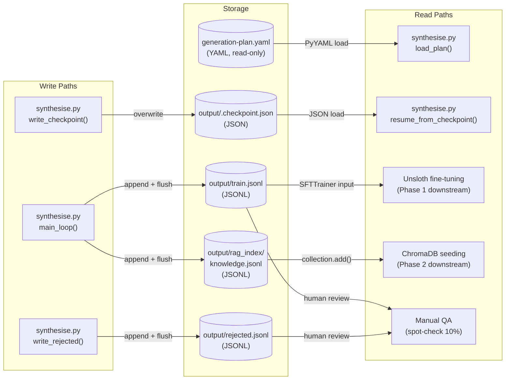
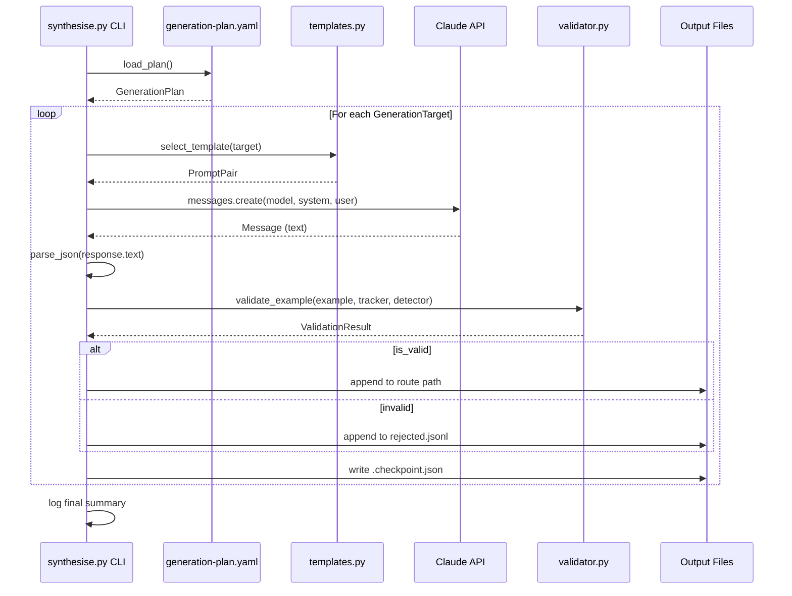
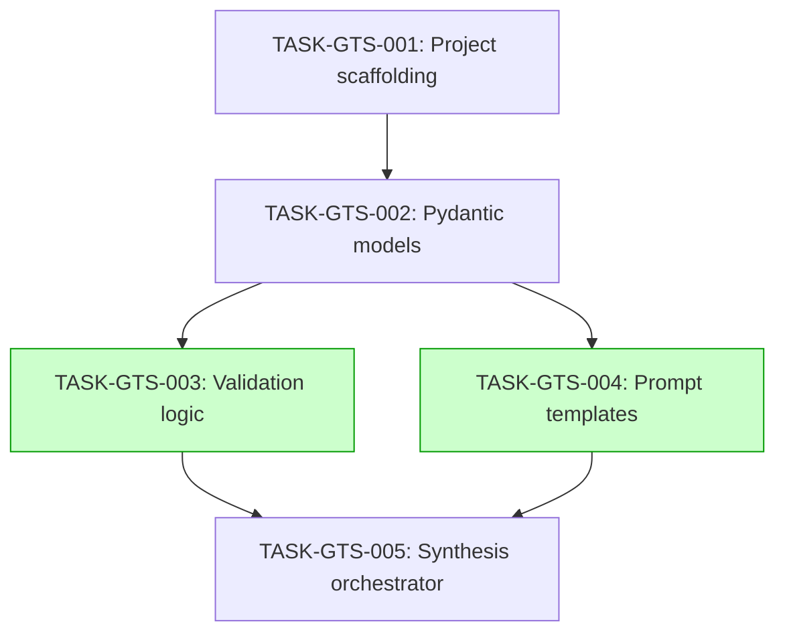

# Implementation Guide: GCSE Training Example Synthesis

**Feature ID:** FEAT-GTS
**Approach:** Sequential Module Build
**Testing:** Full TDD
**Execution:** Auto-detect parallelism

---

## Data Flow: Read/Write Paths

_All write paths have corresponding read paths. No disconnections detected._

---

## Integration Contracts

_Data flows through the complete pipeline: Plan → Template → API → Validation → Output. No "fetch then discard" points._

---

## Task Dependencies

_Tasks with green background (TASK-GTS-003 and TASK-GTS-004) can run in parallel._

---

## §4: Integration Contracts

### Contract: VALIDATION_API
- **Producer task:** TASK-GTS-003
- **Consumer task(s):** TASK-GTS-005
- **Artifact type:** Python module API (function + classes)
- **Format constraint:** `validate_example(example, split_tracker, duplicate_detector)` returns `ValidationResult` with fields `is_valid: bool`, `reason: str | None`, `route: str | None`. `SplitTracker` and `DuplicateDetector` are instantiated by the consumer and passed in.
- **Validation method:** Coach verifies that TASK-GTS-005 imports and calls `validate_example` with correct argument types, and handles both `is_valid=True` and `is_valid=False` return values.

### Contract: TEMPLATE_API
- **Producer task:** TASK-GTS-004
- **Consumer task(s):** TASK-GTS-005
- **Artifact type:** Python module API (function + dataclass)
- **Format constraint:** `select_template(target: GenerationTarget)` returns a callable `(GenerationTarget) -> PromptPair`. `PromptPair` has fields `system_prompt: str` and `user_prompt: str`.
- **Validation method:** Coach verifies that TASK-GTS-005 calls `select_template()` for each target, then calls the returned function, and uses both `system_prompt` and `user_prompt` from the PromptPair in the API call.

---

## Execution Strategy

### Wave 1: Foundation (sequential)
| Task | Mode | Est. Time |
|------|------|-----------|
| TASK-GTS-001: Project scaffolding | direct | 15 min |

### Wave 2: Data Models (sequential)
| Task | Mode | Est. Time |
|------|------|-----------|
| TASK-GTS-002: Pydantic models | task-work (TDD) | 45 min |

### Wave 3: Core Modules (parallel)
| Task | Mode | Est. Time |
|------|------|-----------|
| TASK-GTS-003: Validation logic | task-work (TDD) | 60 min |
| TASK-GTS-004: Prompt templates | task-work (TDD) | 45 min |

### Wave 4: Integration (sequential)
| Task | Mode | Est. Time |
|------|------|-----------|
| TASK-GTS-005: Synthesis orchestrator | task-work (TDD) | 90 min |

**Estimated total:** ~4 hours (with Wave 3 parallelism)

---

## Architecture Notes

### Module isolation
`synthesis/` MUST NOT import from `agents/`, `tools/`, or any Phase 2 module. If a shared utility is needed, it goes in a `common/` module.

### Key design decisions
1. **Sync Anthropic client** — matches ADR-ARCH-006 (sequential generation)
2. **Append-per-line writes** with `flush()` — crash-safe JSONL for overnight GB10 runs
3. **Checkpoint file** — enables resumption without duplication
4. **SHA-256 content hashing** — duplicate detection across retries
5. **Structured JSON logging** — matches ADR-ARCH-007

### Confirmed assumptions
- ASSUM-001: ±5% split tolerance (confirmed)
- ASSUM-002: claude-sonnet-4-5 for synthesis (confirmed)
- ASSUM-003: Max 3 retries with exponential backoff 1s/2s/4s (confirmed)
- ASSUM-004: Progress logged every 10 targets (confirmed)
- ASSUM-005: Multi-turn = 4+ messages after system (confirmed)

### Testing approach
Full TDD — tests written before implementation for each module. Mock the Anthropic client in tests (never call the real API). 28 Gherkin scenarios from the feature spec map to unit tests across the 3 test files.
