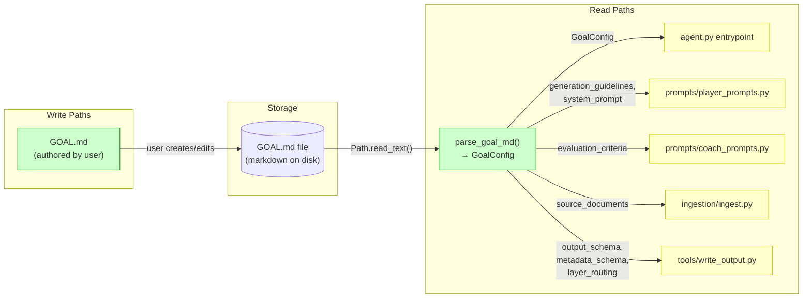
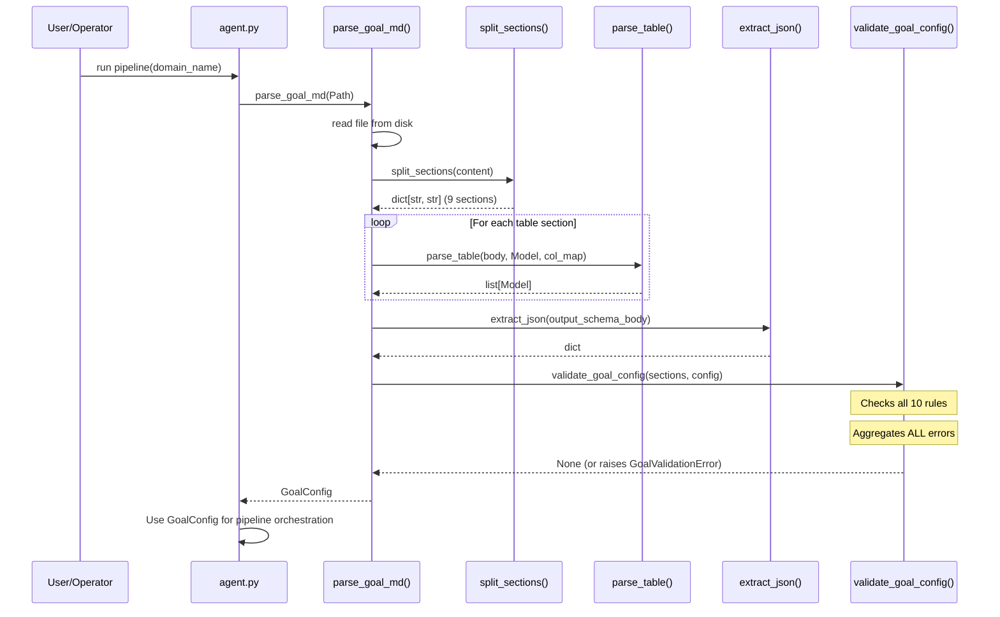
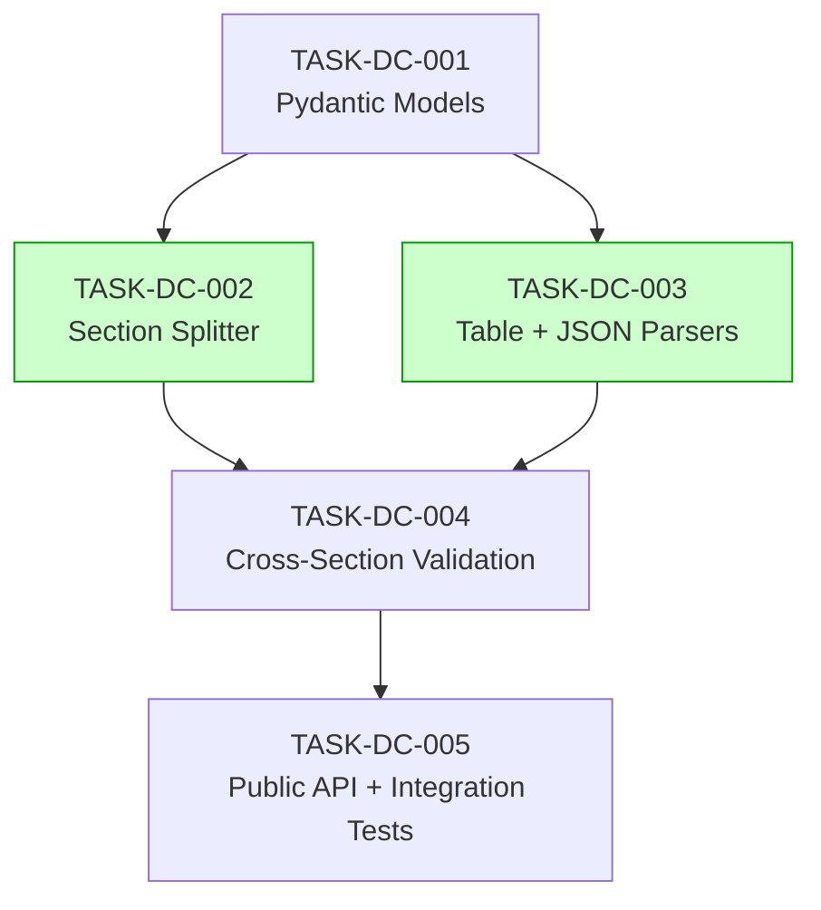

# Implementation Guide: GOAL.md Parser and Strict Validation

> Feature: FEAT-5606 | Review: TASK-REV-DC5D
> Approach: Pydantic v2 Models + Regex Section Splitter

## Architecture Overview

The `domain_config` module is a **leaf module** with no dependencies on other project modules. It reads GOAL.md files from disk and produces a validated `GoalConfig` object consumed by 6 downstream modules.

```
domain_config/
├── __init__.py      ← public API: parse_goal_md, GoalConfig, GoalValidationError
├── models.py        ← Pydantic v2 models for all data structures
├── parser.py        ← Section splitting, table parsing, JSON extraction, parse_goal_md()
└── validators.py    ← Cross-section validation rules, error aggregation
```

## Data Flow: Read/Write Paths



_Green = implemented by this feature. Yellow = downstream consumers (not yet implemented, will be wired by future features)._

**No disconnections**: All read paths have a clear caller chain. The downstream consumers (R2-R6) will be wired when their respective modules are implemented. This is expected — `domain_config` is the foundation module built first.

## Integration Contracts



_Shows the internal call sequence. validate_goal_config receives all parsed data and checks cross-section rules._

## Task Dependencies



_Tasks with green background can run in parallel._

## §4: Integration Contracts

### Contract: SECTION_DICT
- **Producer task:** TASK-DC-002 (Section splitter)
- **Consumer task(s):** TASK-DC-004 (Cross-section validation), TASK-DC-005 (Public API)
- **Artifact type:** Python dict return value
- **Format constraint:** `dict[str, str]` with exactly 9 keys matching the required section names. Values are stripped body text.
- **Validation method:** Coach verifies `split_sections()` returns dict with all 9 keys; consumer calls it directly.

### Contract: PARSED_MODELS
- **Producer task:** TASK-DC-003 (Table + JSON parsers)
- **Consumer task(s):** TASK-DC-004 (Cross-section validation), TASK-DC-005 (Public API)
- **Artifact type:** Python lists of Pydantic model instances
- **Format constraint:** `list[SourceDocument]`, `list[GenerationTarget]`, `list[EvaluationCriterion]`, `list[MetadataField]`, `dict` (output schema), `dict[str, str]` (layer routing). All instances are validated Pydantic models.
- **Validation method:** Coach verifies return types match model classes; Pydantic validation ensures field constraints.

## Execution Strategy

### Wave 1: Foundation (1 task — direct mode)

| Task | Description | Complexity | Mode |
|------|-------------|-----------|------|
| TASK-DC-001 | Create domain_config package + Pydantic models | 3 | direct |

**Rationale**: Simple declarative task. No architectural decisions — models are fully specified by the API contract.

### Wave 2: Parsing (2 tasks — parallel, task-work mode)

| Task | Description | Complexity | Mode |
|------|-------------|-----------|------|
| TASK-DC-002 | Markdown section splitter | 4 | task-work |
| TASK-DC-003 | Table parser + JSON extractor | 5 | task-work |

**Rationale**: These tasks operate on independent concerns (section splitting vs table/JSON parsing) and share no files. Safe to run in parallel.

### Wave 3: Validation + API (2 tasks — sequential, task-work mode)

| Task | Description | Complexity | Mode |
|------|-------------|-----------|------|
| TASK-DC-004 | Cross-section validation + error aggregation | 5 | task-work |
| TASK-DC-005 | Public API + integration tests | 4 | task-work |

**Rationale**: TASK-DC-004 depends on both Wave 2 tasks. TASK-DC-005 depends on TASK-DC-004 (needs validation to compose the full API). These must run sequentially within Wave 3.

## Key Design Decisions

1. **Pydantic v2 over dataclasses**: Consistent with existing `synthesis/validator.py`. Gives us `field_validator`, `Literal` types, and rich error messages for free.

2. **Whitelist regex splitter**: Only split on the 9 known section headings. This handles the edge case where content contains `## Example Approach` without creating a false section boundary.

3. **Error aggregation pattern**: Collect all failures in a `list[tuple[str, str]]` then raise a single `GoalValidationError`. This matches assumption ASSUM-002 (report all errors at once).

4. **Counts authoritative, percentages advisory**: Per assumption ASSUM-003, the reasoning split is calculated from counts, not percentages.

## BDD Scenario Coverage Map

| Task | BDD Scenarios Covered |
|------|----------------------|
| TASK-DC-001 | Model construction, field types |
| TASK-DC-002 | Lines 21-25 (valid), 146-162 (missing sections), 220-224 (empty), 229-234 (whitespace), 272-277 (embedded headings) |
| TASK-DC-003 | Lines 36-40 (Source Docs), 50-56 (Gen Targets), 57-63 (Eval Criteria), 66-71 (Output Schema), 75-79 (Layer Routing), 237-241 (table formatting), 309-314 (nested fences), 317-322 (empty Valid Values) |
| TASK-DC-004 | Lines 84-140 (all boundary), 172-217 (all negative validation), 253-260 (multiple failures), 280-286 (keyword), 298-304 (percentages) |
| TASK-DC-005 | Full integration: all 36 scenarios end-to-end |

## Risk Mitigations

| Risk | Mitigation |
|------|-----------|
| Embedded `##` headings | Whitelist approach — only 9 known names trigger splits |
| Table formatting variations | Strip/trim all cells, handle missing trailing pipes |
| JSON code fence edge cases | Extract between first `` ```json `` and next `` ``` `` only |
| Unicode content | Python 3.11 handles UTF-8 natively; no special handling needed |
