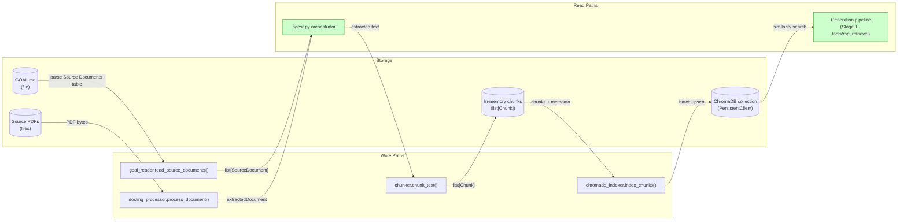
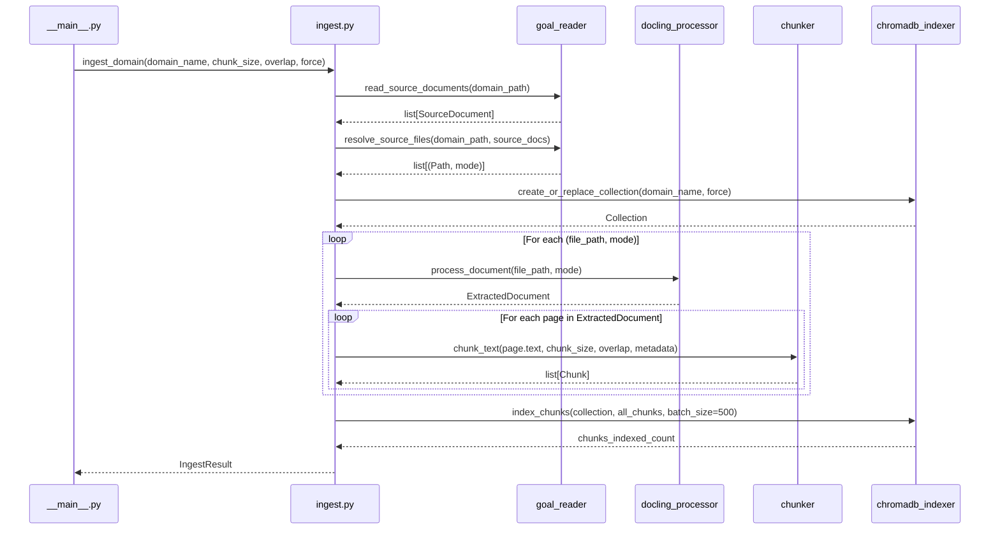
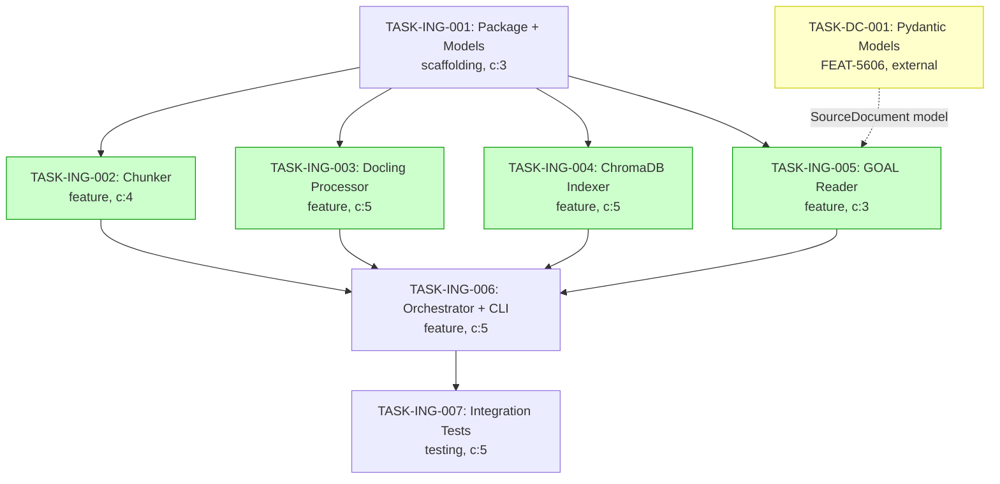

# Implementation Guide: Ingestion Pipeline

## Architecture: Thin Orchestrator + Isolated Components

```
ingestion/
├── __init__.py          # Public API exports
├── __main__.py          # CLI entry point (argparse)
├── ingest.py            # ingest_domain() orchestrator
├── goal_reader.py       # Read GOAL.md Source Documents, resolve file patterns
├── docling_processor.py # Docling standard + VLM extraction (lazy import)
├── chunker.py           # chunk_text() via RecursiveCharacterTextSplitter
├── chromadb_indexer.py  # ChromaDB PersistentClient collection CRUD + batch upsert
├── models.py            # Chunk, IngestResult, SourceDocument stub, ExtractedDocument
└── errors.py            # IngestionError hierarchy
```

## Data Flow: Read/Write Paths



_All write paths have corresponding read paths. No disconnections detected._

## Integration Contracts



_Data flows from CLI through orchestrator to each component and back. No data is fetched and discarded._

## §4: Integration Contracts

### Contract: SourceDocument

- **Producer task:** TASK-DC-001 (Create domain_config package and Pydantic models) — part of FEAT-5606
- **Consumer task(s):** TASK-ING-005 (Implement GOAL.md Source Documents reader)
- **Artifact type:** Python class (Pydantic BaseModel)
- **Format constraint:** `SourceDocument` with fields `file_pattern: str`, `mode: Literal["standard", "vlm"]`, `notes: str = ""`. Until TASK-DC-001 completes, the ingestion pipeline uses a compatible stub in `ingestion/models.py`.
- **Validation method:** Seam test in TASK-ING-005 verifies the SourceDocument contract (field names, types, and mode literal values)

## Task Dependencies



_Tasks with green background can run in parallel within their wave. Yellow = external dependency._

## Execution Strategy

### Wave 1: Foundation (parallel)
- **TASK-ING-001:** Create package, models, errors (scaffolding, direct)
- **TASK-ING-002:** Implement chunker (feature, task-work) — can start as soon as `models.py` exists

### Wave 2: Components (parallel)
- **TASK-ING-003:** Docling processor (feature, task-work)
- **TASK-ING-004:** ChromaDB indexer (feature, task-work)
- **TASK-ING-005:** GOAL.md reader (feature, direct)

All three can run in parallel — they depend only on TASK-ING-001 (models/errors), not on each other.

### Wave 3: Orchestration
- **TASK-ING-006:** Orchestrator + CLI (feature, task-work) — depends on all Wave 1-2 tasks

### Wave 4: Verification
- **TASK-ING-007:** Integration tests (testing, task-work) — depends on TASK-ING-006

## Key Design Decisions

1. **Lazy Docling import** — Docling is heavy (~2GB models); import only when `process_document()` is called
2. **Sequential document processing** — per ADR-ARCH-006, no parallel processing in v1
3. **Batch ChromaDB indexing** — configurable batch_size (default 500) to avoid OOM on large collections
4. **SourceDocument stub** — use temporary stub until FEAT-5606 Wave 1 completes; seam test validates contract
5. **Deterministic chunk IDs** — `{domain}_{source_file}_{chunk_index}` for idempotent re-indexing
6. **Force re-ingestion warning** — ASSUM-004 (concurrent access unsafe) logged on `--force`

## Dependencies to Add

```toml
# pyproject.toml additions
dependencies = [
    # ... existing ...
    "docling>=2.0",
    "chromadb>=0.5",
    "langchain-text-splitters>=0.3",
]
```

## Risk Mitigations

| Risk | Mitigation |
|------|------------|
| Docling VLM fails on GB10 | Mock VLM in tests; fallback to standard mode with warning |
| Large PDF OOM | Sequential processing + structured logging of memory milestones |
| GOAL.md parser not ready | SourceDocument stub + seam test ensures safe migration |
| Concurrent re-ingestion | ASSUM-004 warning logged on `--force`; documented in CLI help |
