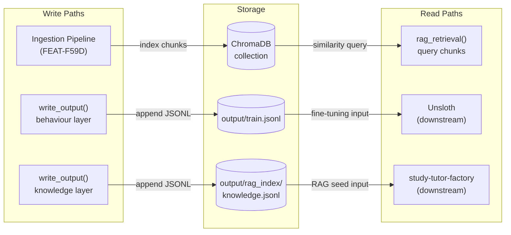
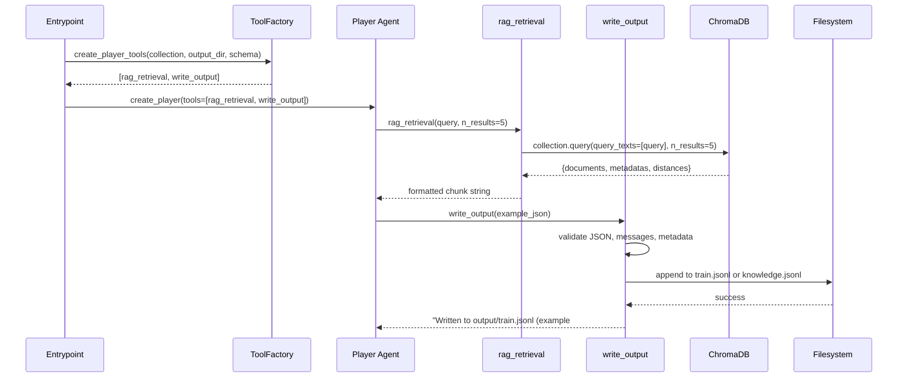
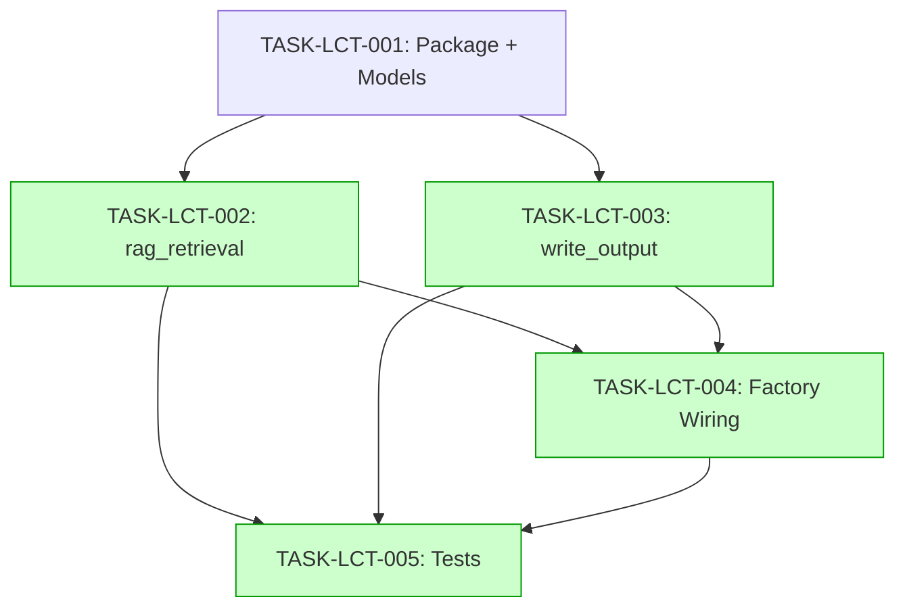

# Implementation Guide: LangChain Tools — RAG Retrieval and Write Output

## Approach

**Closure-Based Factories** — each factory function returns an inner `@tool`-decorated closure that captures configuration (collection name, output directory, metadata schema) in its enclosing scope. This matches the API contract exactly and is idiomatic for LangChain tools.

## Data Flow: Read/Write Paths



_All write and read paths are connected. No disconnections detected._

## Integration Contracts



_Data flows end-to-end from factory creation through tool invocation to storage._

## Task Dependencies



_Tasks with green background can run in parallel within their wave._

## §4: Integration Contracts

### Contract: CHROMADB_COLLECTION

- **Producer task:** FEAT-F59D (Ingestion Pipeline — specifically TASK-ING-004)
- **Consumer task(s):** TASK-LCT-002 (rag_retrieval)
- **Artifact type:** ChromaDB persistent collection
- **Format constraint:** Collection queryable via `chromadb.PersistentClient`, collection name matches domain config `collection_name` field, chunks have `source` and `page` metadata keys
- **Validation method:** Coach verifies `rag_retrieval` returns chunks with source metadata headers when queried against a populated collection

### Contract: METADATA_SCHEMA

- **Producer task:** TASK-LCT-001 (Pydantic models — local MetadataField compatible type)
- **Consumer task(s):** TASK-LCT-003 (write_output validation)
- **Artifact type:** Python list of MetadataField objects
- **Format constraint:** `list[MetadataField]` where each MetadataField has `field: str`, `type: str`, `required: bool`, `valid_values: list[str]` attributes (Pydantic v2 BaseModel)
- **Validation method:** Coach verifies write_output rejects metadata values not in `valid_values` for each field

### Contract: GOAL_CONFIG_METADATA

- **Producer task:** FEAT-5606 (Goal MD Parser — specifically TASK-DC-001)
- **Consumer task(s):** TASK-LCT-003 (write_output via factory injection)
- **Artifact type:** Parsed GoalConfig.metadata_schema
- **Format constraint:** `list[MetadataField]` from `domain_config.models.MetadataField` — same interface as local type, to be replaced when FEAT-5606 lands
- **Validation method:** Coach verifies metadata_schema from GoalConfig is accepted by create_write_output_tool factory

## Execution Plan

### Wave 1 (Foundation)
| Task | Mode | Description |
|------|------|-------------|
| TASK-LCT-001 | direct | Package structure + Pydantic validation models |

### Wave 2 (Parallel — tool implementations)
| Task | Mode | Description |
|------|------|-------------|
| TASK-LCT-002 | task-work | rag_retrieval factory + ChromaDB integration |
| TASK-LCT-003 | task-work | write_output factory + layer routing + validation |

### Wave 3 (Integration)
| Task | Mode | Description |
|------|------|-------------|
| TASK-LCT-004 | direct | Tool assignment wiring + D5 invariant |
| TASK-LCT-005 | task-work | Full test suite (41 BDD scenarios) |

## Key Design Decisions

1. **Closure over class** — `@tool` decorator on inner function, configuration captured in closure scope. Matches API contract, minimal boilerplate.
2. **Lazy ChromaDB init** — `PersistentClient` created on first `rag_retrieval` call, stored as `nonlocal`. Avoids connection at import time.
3. **Ordered validation** — `write_output` checks are executed in the exact order specified by API contract. First failure returns immediately.
4. **Append + flush** — `open(path, "a")` + `f.flush()` per write. No buffering, no locking (ADR-ARCH-006 guarantees single writer).
5. **Local MetadataField** — Define compatible type in `tools/models.py` until FEAT-5606 lands, then swap to import.

## Package Dependencies to Add

```toml
# pyproject.toml additions needed
"langchain-core>=0.3.0",
"chromadb>=0.5.0",
```

These should be added as part of TASK-LCT-001 (scaffolding).
